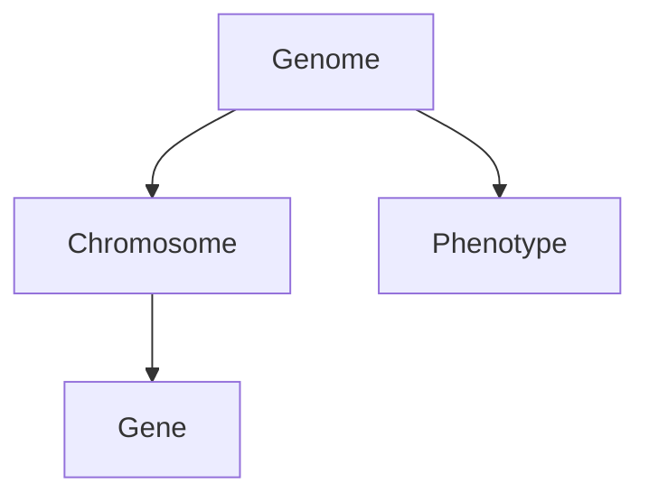

# Markdown Formatting Rules for Obsidian.md Compatibility

This project's documentation is viewed using Obsidian.md. Follow these rules to ensure proper rendering.

## Required Rules

### Tables Must Have Blank Lines Above Them

Obsidian.md requires a blank line before markdown tables for them to render correctly.

**❌ Incorrect:**
```markdown
**Available Options:**
| Option | Description |
|--------|-------------|
| A | First choice |
```

**✅ Correct:**
```markdown
**Available Options:**

| Option | Description |
|--------|-------------|
| A | First choice |
```

This applies when tables follow:
- Headers (`### Section`)
- Bold text (`**Label:**`)
- Regular paragraphs
- Lists
- Any non-blank content

### Use Fenced Code Blocks

Always use triple backticks with language identifiers for code:

```cpp
void example() {
    // Code here
}
```

## Obsidian.md Optimization Suggestions

Consider using these Obsidian-specific features to enhance documentation:

### Internal Links

Use Obsidian's wiki-style links for cross-referencing within the vault:

```markdown
See [[architecture]] for system design details.
Link to specific heading: [[architecture#Core Components]]
```

### Tags for Categorization

Add tags to documents for better organization and searching:

```markdown
#genetics #implementation #phase2
```

Or in YAML frontmatter:
```yaml
---
tags: [genetics, implementation, phase2]
---
```

### Frontmatter/YAML Metadata

Add metadata at the top of documents:

```yaml
---
title: Gene Reference
created: 2025-12-23
updated: 2025-12-23
status: complete
tags: [genetics, reference]
---
```

### Callouts for Important Notes

Use Obsidian callouts to highlight important information:

```markdown
> [!NOTE]
> General information or tips.

> [!WARNING]
> Important warnings about potential issues.

> [!TIP]
> Helpful suggestions.

> [!IMPORTANT]
> Critical information that must not be missed.

> [!CAUTION]
> Negative consequences to avoid.

> [!EXAMPLE]
> Example usage or implementation.
```

### Mermaid Diagrams

Obsidian supports Mermaid diagrams for architecture visualization:

````markdown

````

### Folder Organization

Structure folders to work well with Obsidian's graph view:
- Group related documents together
- Use consistent naming conventions
- Create index files (README.md) in each folder
- Keep filenames short and descriptive

### Embedding Content

Embed content from other files:

```markdown
![[diagram.png]]
![[other-document#Section]]
![[other-document]]
```

## Validation Command

To find tables missing blank lines above them:

```bash
find docs/ plans/ -name "*.md" -exec grep -l '^|' {} \; 2>/dev/null | while read f; do
  awk '
    /^\|/ && prev !~ /^$/ && prev !~ /^\|/ { print FILENAME ":" NR }
    { prev = $0 }
  ' "$f"
done
```

## Files This Rule Applies To

- `docs/**/*.md`
- `plans/**/*.md`
- `*.md` (root level)
- `.roo/**/*.md`
