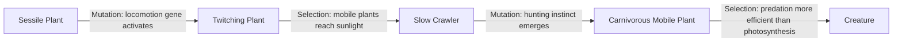

# Unified Organism Genome Design

**Author:** Gary Ferguson
**Date:** 2025-12-22
**Updated:** 2025-12-27
**Status:** Phase 1 Complete, Phase 2 In Progress - UniversalGenes exists, BehaviorController + IBehavior implemented, but Creature/Plant are still separate classes
**Scope:** Conceptual design for merging creature and plant gene pools

---

## Executive Summary

This document explores a radical redesign of EcoSim's genetics system: **unifying the gene pool for all organisms**. Rather than maintaining separate genetics for creatures and plants, all organisms would share a universal gene registry. An organism's "type" (creature, plant, hybrid) would emerge from which genes it expresses, rather than being a fixed classification.

This design enables:
- **Evolutionary convergence**: Creatures evolving plant-like traits (photosynthesis)
- **Evolutionary divergence**: Plants evolving creature-like traits (locomotion)
- **Emergent speciation**: Organisms transitioning between types over generations
- **Behavioral emergence**: Capabilities determined by expressed genes, not hard-coded types

---

## Table of Contents

1. [Current Architecture Analysis](#1-current-architecture-analysis)
2. [Unified Gene Pool Concept](#2-unified-gene-pool-concept)
3. [Expression-Based Capability System](#3-expression-based-capability-system)
4. [Emergent Classification System](#4-emergent-classification-system)
5. [Evolutionary Pathways](#5-evolutionary-pathways)
6. [Architectural Changes](#6-architectural-changes)
7. [Gameplay Implications](#7-gameplay-implications)
8. [Implementation Challenges](#8-implementation-challenges)
9. [Recommendations](#9-recommendations)

---

## 1. Current Architecture Analysis

### 1.1 Current Separation

**Creatures** ([`DefaultGenes`](../include/genetics/defaults/DefaultGenes.hpp)):
- **Sensory**: `sight` (vision range)
- **Locomotion**: Movement capabilities (implicit, not gene-based yet)
- **Metabolism**: `hunger_threshold`, `thirst_threshold`, `fatigue_threshold`, `comfort_increase/decrease`, `diet`
- **Behavior**: `flocks`, `flee_distance`, `pursue_distance`
- **Reproduction**: `mate_threshold`
- **Lifespan**: `lifespan`

**Plants** ([`PlantGenes`](../include/genetics/defaults/PlantGenes.hpp)):
- **Morphology**: `max_size`, `hardiness`, `color_hue`
- **Metabolism**: `growth_rate`, `water_need`, `light_need`, `nutrient_value`
- **Reproduction**: `seed_production`, `spread_distance`
- **Environmental**: `temp_tolerance_low/high`
- **Lifespan**: `plant_lifespan`

### 1.2 Shared Infrastructure

Both organism types already share:
- [`Genome`](../include/genetics/core/Genome.hpp) - 8 chromosomes (diploid system)
- [`Gene`](../include/genetics/core/Gene.hpp) - Allele pairs with dominance
- [`GeneRegistry`](../include/genetics/core/GeneRegistry.hpp) - Definition storage
- [`Phenotype`](../include/genetics/expression/Phenotype.hpp) - Expression with environmental context
- **Expression strength**: Alleles have `expression_strength` (0.0-1.0) ✓

### 1.3 Key Insight

The infrastructure already supports unified genetics. The **separation is only at the gene definition level**—there's no fundamental architectural barrier to merging.

---

## 2. Unified Gene Pool Concept

### 2.1 Universal Gene Registry

Create a single `UniversalGeneRegistry` containing ALL possible genes:

```cpp
namespace EcoSim::Genetics {
    class UniversalGenes {
        static void registerAll(GeneRegistry& registry);
    };
}
```

### 2.2 Gene Categories

#### **Universal Genes** (all organisms)
- `lifespan` - Maximum age
- `size` - Body/plant size
- `metabolism_rate` - Energy consumption rate
- `color_hue` - Visual appearance
- `temp_tolerance_low` / `temp_tolerance_high` - Climate adaptation
- `hardiness` - Damage resistance

#### **Mobility Genes** (traditionally creature)
- `locomotion_speed` - Movement rate (0.0 = sessile, >0 = mobile)
- `navigation_ability` - Pathfinding intelligence
- `sight_range` - Visual perception
- `flee_threshold` - Danger avoidance
- `pursuit_threshold` - Prey/mate seeking

#### **Autotrophy Genes** (traditionally plant)
- `photosynthesis_efficiency` - Energy from light (0.0-1.0)
- `root_depth` - Nutrient absorption from soil
- `water_storage` - Drought resistance
- `chlorophyll_density` - Photosynthetic capacity

#### **Heterotrophy Genes** (traditionally creature)
- `hunt_instinct` - Predatory behavior
- `diet_type` - Food preferences (enum: herbivore, carnivore, omnivore)
- `hunger_threshold` - When to seek food
- `digestive_efficiency` - Energy extraction from food

#### **Reproduction Genes** (universal, varied expression)
- `reproduction_type` - Sexual, asexual, budding (enum)
- `offspring_count` - Litter size / seed production
- `mate_selectivity` - Partner fitness requirements
- `spread_distance` - Dispersal range (seeds vs. territory)

#### **Social Genes** (optional expression)
- `flocking_tendency` - Gregarious vs. solitary
- `communication_ability` - Information sharing
- `parental_care` - Offspring investment

### 2.3 Expression vs. Possession

**Critical Distinction**: An organism can HAVE a gene without EXPRESSING it.

```
Example 1: Dormant Photosynthesis in Creature
- Genome: photosynthesis_efficiency = 0.65 (potential!)
- Expression: allele.expression_strength = 0.05 (mostly dormant)
- Phenotype: organism produces minimal energy from light
- Over generations: Environmental pressure → increased expression_strength → functional photosynthesis

Example 2: Vestigial Locomotion in Plant
- Genome: locomotion_speed = 0.15 (inherited from mobile ancestor)
- Expression: allele.expression_strength = 0.02 (nearly silent)
- Phenotype: Plant cannot move
- Over generations: Gene may be lost via mutation or reactivated by environmental pressure
```

This mirrors real-world biology:
- **Epigenetics**: Gene expression changes without DNA mutation
- **Vestigial traits**: Cave fish with eye genes but no functional eyes
- **Convergent evolution**: Different species developing similar traits

---

## 3. Expression-Based Capability System

### 3.1 Capability Thresholds

Instead of hard-coded organism types, **capabilities emerge from gene expression**:

```cpp
// Pseudo-code for capability determination
struct OrganismCapabilities {
    bool canMove() const {
        float locomotion = phenotype.getTrait("locomotion_speed");
        return locomotion > LOCOMOTION_THRESHOLD; // e.g., 0.3
    }
    
    bool canPhotosynthesize() const {
        float photo = phenotype.getTrait("photosynthesis_efficiency");
        return photo > PHOTOSYNTHESIS_THRESHOLD; // e.g., 0.2
    }
    
    bool canHunt() const {
        float hunt = phenotype.getTrait("hunt_instinct");
        float locomotion = phenotype.getTrait("locomotion_speed");
        return hunt > 0.4 && locomotion > 0.3;
    }
    
    bool isAutotrophic() const {
        return canPhotosynthesize() && 
               phenotype.getTrait("photosynthesis_efficiency") > 0.5;
    }
    
    bool isHeterotrophic() const {
        float hunger = phenotype.getTrait("hunger_threshold");
        return hunger > 0.0 && !isAutotrophic();
    }
};
```

### 3.2 Behavior Components

Replace hard-coded behavior with **modular components activated by gene expression**:

```
Current Architecture (Hard-coded):
    Creature → has hungryProfile(), breedProfile(), migrateProfile()
    Plant → has update(), grow(), spreadSeeds()

Proposed Architecture (Component-based):
    Organism → capabilities determine active behaviors
    
    if (capabilities.canMove() && capabilities.isHeterotrophic()) {
        activate MovementBehavior
        activate ForagingBehavior
    }
    
    if (capabilities.canPhotosynthesize()) {
        activate PhotosynthesisBehavior
        activate SunSeekingBehavior (if can move)
    }
    
    if (capabilities.canHunt()) {
        activate HuntingBehavior
        activate PreyTrackingBehavior
    }
```

### 3.3 Energy Budget

Organisms would have a **unified energy budget** with multiple sources/sinks:

```
Energy Sources:
  + photosynthesis_efficiency × light_level × chlorophyll_density
  + digested_food × digestive_efficiency
  + absorbed_nutrients × root_depth (if sessile)

Energy Costs:
  - movement_cost × locomotion_speed × distance_traveled
  - basal_metabolism × metabolism_rate
  - reproduction_cost × offspring_count
  - brain_cost × navigation_ability × sight_range
```

Organisms optimize their energy budget based on available genes:
- **Mobile herbivore with photosynthesis**: Moves to sunny spots, reduces need to forage
- **Sessile carnivore**: Carnivorous plant traps prey, minimal energy from light
- **Photosynthetic slow-mover**: Minimizes movement to sunny locations only

---

## 4. Emergent Classification System

### 4.1 Dynamic Typing

Instead of `class Creature` and `class Plant`, organisms are classified by **expressed traits**:

```cpp
enum class OrganismArchetype {
    Plant,              // Sessile autotroph
    Creature,           // Mobile heterotroph
    MobilePlant,        // Mobile autotroph (e.g., algae-like)
    SessileCreature,    // Sessile heterotroph (e.g., barnacle, carnivorous plant)
    Phototroph,         // Mobile with photosynthesis (hybrid)
    Fungoid,            // Sessile decomposer (neither auto/heterotroph)
    Symbiont            // Mixed energy strategies
};

class OrganismClassifier {
    static OrganismArchetype classify(const OrganismCapabilities& caps) {
        float locomotion = caps.getLocomotion();
        float photosynthesis = caps.getPhotosynthesis();
        float hunt_instinct = caps.getHuntInstinct();
        
        // Classification decision tree
        if (locomotion > 0.5) {
            if (photosynthesis > 0.5) return OrganismArchetype::MobilePlant;
            if (hunt_instinct > 0.4) return OrganismArchetype::Creature;
            if (photosynthesis > 0.3) return OrganismArchetype::Phototroph;
            return OrganismArchetype::Creature; // Default mobile
        } else {
            if (photosynthesis > 0.5) return OrganismArchetype::Plant;
            if (hunt_instinct > 0.4) return OrganismArchetype::SessileCreature;
            if (photosynthesis < 0.3 && hunt_instinct < 0.3) {
                return OrganismArchetype::Fungoid;
            }
            return OrganismArchetype::Symbiont;
        }
    }
};
```

### 4.2 Smooth Transitions

Classification is **continuous, not binary**:

```
Generation 1: Creature (locomotion=0.8, photosynthesis=0.1)
Generation 5: Creature (locomotion=0.8, photosynthesis=0.25) - slight greening
Generation 10: Phototroph (locomotion=0.7, photosynthesis=0.45) - hybrid
Generation 20: Mobile Plant (locomotion=0.6, photosynthesis=0.7) - mostly autotrophic
Generation 30: Plant (locomotion=0.2, photosynthesis=0.85) - sessile, photosynthetic
```

### 4.3 Behavioral Polymorphism

Organisms with similar genetics but different environmental contexts express differently:

```
Same Genome in Different Environments:

Arctic Environment (low light, cold):
  → Expression: High locomotion (must search for food)
  → Low photosynthesis expression (insufficient light)
  → Classification: Creature

Tropical Environment (high light, warm):
  → Expression: Moderate locomotion (less need to search)
  → High photosynthesis expression (abundant light)
  → Classification: Phototroph
```

This is analogous to **phenotypic plasticity** in real organisms (e.g., water plants vs. land plants of the same species).

---

## 5. Evolutionary Pathways

### 5.1 Creature → Plant Transition

**Scenario**: Food scarcity drives photosynthesis evolution


**Generational Changes**:
1. **Generation 0**: Pure creature, hunts plants for food
2. **Generation 10**: Mutation activates dormant photosynthesis gene (expression_strength: 0.05 → 0.15)
3. **Generation 20**: Selection favors photosynthesizers during food scarcity (expression: 0.15 → 0.35)
4. **Generation 30**: Hybrid emerges—moves to sunny spots, supplements with photosynthesis
5. **Generation 50**: Locomotion becomes metabolically expensive; sessile forms favored
6. **Generation 80**: Organism is functionally a plant—rooted, photosynthetic, spreads seeds

### 5.2 Plant → Creature Transition

**Scenario**: Shaded environment drives mobility evolution



**Generational Changes**:
1. **Generation 0**: Sessile plant in shaded forest floor
2. **Generation 15**: Mutation activates vestigial locomotion genes from distant ancestor
3. **Generation 25**: Slight movement ability allows reaching sun patches (selection advantage)
4. **Generation 40**: Mobile plant—crawls toward light slowly
5. **Generation 60**: Mutation activates hunt_instinct; begins trapping small creatures
6. **Generation 90**: Photosynthesis becomes less efficient than predation
7. **Generation 120**: Functionally a creature—mobile carnivore

### 5.3 Convergent Evolution

**Scenario**: Different lineages independently evolve similar traits

```
Lineage A: Desert Plant
  → Evolves water_storage gene (high expression)
  → Develops hardiness for heat resistance
  → Result: Cactus-like organism

Lineage B: Desert Creature
  → Evolves water_storage gene (from plant ancestor interbreeding)
  → Develops hardiness via mutation
  → Reduces locomotion to conserve water
  → Result: Cactus-like organism

Both reach similar phenotype via different paths!
```

### 5.4 Symbiosis & Horizontal Gene Transfer

**Mechanism**: Simulate gene "jumping" between organisms

```cpp
// Pseudo-code
class GeneTransferEvent {
    bool attemptHorizontalTransfer(Organism& donor, Organism& recipient) {
        // Very low probability event
        if (random() < TRANSFER_PROBABILITY) {
            // Transfer high-value gene from donor to recipient
            Gene transferred = donor.getHighestValueGene();
            recipient.addGeneToGenome(transferred);
            return true;
        }
        return false;
    }
};
```

**Examples**:
- Creature absorbs photosynthetic algae → gains photosynthesis genes (like sea slugs)
- Plant captures insect DNA → gains digestive enzyme genes (carnivorous plants)

---

## 6. Architectural Changes

### 6.1 Unified Base Class

Replace separate `Creature` and `Plant` classes with unified `Organism`:

```cpp
// Current (Separate Hierarchies):
class Creature : public GameObject { ... };
class Plant : public IPositionable, ILifecycle, IGeneticOrganism { ... };

// Proposed (Unified):
class Organism : public IPositionable, ILifecycle, IGeneticOrganism {
protected:
    Genome genome_;
    Phenotype phenotype_;
    OrganismCapabilities capabilities_;
    OrganismArchetype archetype_;
    
    // Behavior components (activated based on capabilities)
    std::unique_ptr<MovementBehavior> movement_;
    std::unique_ptr<PhotosynthesisBehavior> photosynthesis_;
    std::unique_ptr<HuntingBehavior> hunting_;
    std::unique_ptr<ReproductionBehavior> reproduction_;
    
public:
    void update(const EnvironmentState& env) {
        // Update phenotype context
        phenotype_.updateContext(env, getOrganismState());
        
        // Recalculate capabilities
        capabilities_.update(phenotype_);
        
        // Reclassify organism
        archetype_ = OrganismClassifier::classify(capabilities_);
        
        // Activate/deactivate behaviors
        updateBehaviors();
        
        // Execute active behaviors
        executeBehaviors(env);
    }
    
    void updateBehaviors() {
        // Enable/disable based on capabilities
        if (capabilities_.canMove() && !movement_) {
            movement_ = std::make_unique<MovementBehavior>(this);
        } else if (!capabilities_.canMove() && movement_) {
            movement_.reset(); // Deactivate
        }
        
        // Similar for other behaviors...
    }
};
```

### 6.2 Behavior Component System

```cpp
class IBehavior {
public:
    virtual ~IBehavior() = default;
    virtual void execute(Organism& org, const EnvironmentState& env) = 0;
    virtual bool isActive() const = 0;
};

class MovementBehavior : public IBehavior {
    void execute(Organism& org, const EnvironmentState& env) override {
        float speed = org.getPhenotype().getTrait("locomotion_speed");
        if (speed > 0.3f) {
            // Navigate toward goals
            navigate(org, env);
        }
    }
};

class PhotosynthesisBehavior : public IBehavior {
    void execute(Organism& org, const EnvironmentState& env) override {
        float efficiency = org.getPhenotype().getTrait("photosynthesis_efficiency");
        float energy = efficiency * env.light_intensity * PHOTOSYNTHESIS_RATE;
        org.addEnergy(energy);
    }
};

class HuntingBehavior : public IBehavior {
    void execute(Organism& org, const EnvironmentState& env) override {
        float hunt_instinct = org.getPhenotype().getTrait("hunt_instinct");
        if (hunt_instinct > 0.4f && org.getHunger() > org.getHungerThreshold()) {
            findAndCapturePrey(org, env);
        }
    }
};
```

### 6.3 Gene Registry Changes

```cpp
// Current (Separate):
DefaultGenes::registerDefaults(creatureRegistry);
PlantGenes::registerDefaults(plantRegistry);

// Proposed (Unified):
class UniversalGenes {
    static void registerAll(GeneRegistry& registry) {
        // Universal genes
        registerUniversalGenes(registry);
        
        // Mobility genes (all organisms CAN have)
        registerMobilityGenes(registry);
        
        // Autotrophy genes (all organisms CAN have)
        registerAutotrophyGenes(registry);
        
        // Heterotrophy genes (all organisms CAN have)
        registerHeterotrophyGenes(registry);
        
        // Reproduction genes (all organisms CAN have)
        registerReproductionGenes(registry);
        
        // Social genes (optional)
        registerSocialGenes(registry);
    }
};

// Usage:
GeneRegistry universalRegistry;
UniversalGenes::registerAll(universalRegistry);

// All organisms use the same registry
Organism org1(x, y, universalRegistry);
Organism org2(x, y, universalRegistry);
```

### 6.4 Chromosome Utilization

All 8 chromosomes become available to all organisms:

```
ChromosomeType::Morphology     - Size, color, structure (universal)
ChromosomeType::Sensory        - Sight, smell, perception (creature-heavy)
ChromosomeType::Metabolism     - Energy systems (universal)
ChromosomeType::Locomotion     - Movement genes (creature-heavy, but plants can evolve)
ChromosomeType::Behavior       - Social, hunting (creature-heavy)
ChromosomeType::Reproduction   - Mating/seeds (universal, different expression)
ChromosomeType::Environmental  - Climate tolerance (universal)
ChromosomeType::Lifespan       - Longevity (universal)
```

### 6.5 Initialization Strategy

```cpp
class OrganismFactory {
    // Create organism with preset archetype (backward compatible)
    static Organism createCreature(int x, int y, const GeneRegistry& registry) {
        Genome genome = createGenomeWithPreset(registry, "creature");
        return Organism(x, y, genome, registry);
    }
    
    static Organism createPlant(int x, int y, const GeneRegistry& registry) {
        Genome genome = createGenomeWithPreset(registry, "plant");
        return Organism(x, y, genome, registry);
    }
    
    // Create fully random organism
    static Organism createRandom(int x, int y, const GeneRegistry& registry) {
        Genome genome = createRandomGenome(registry);
        return Organism(x, y, genome, registry);
    }

private:
    static Genome createGenomeWithPreset(const GeneRegistry& reg, 
                                         const std::string& preset) {
        Genome genome;
        
        if (preset == "creature") {
            // High locomotion, low photosynthesis, moderate hunt_instinct
            setGeneExpression(genome, "locomotion_speed", 0.7, 0.8);
            setGeneExpression(genome, "photosynthesis_efficiency", 0.05, 0.1);
            setGeneExpression(genome, "hunt_instinct", 0.5, 0.6);
            // ... other genes
        } else if (preset == "plant") {
            // Low locomotion, high photosynthesis, no hunt_instinct
            setGeneExpression(genome, "locomotion_speed", 0.05, 0.1);
            setGeneExpression(genome, "photosynthesis_efficiency", 0.7, 0.9);
            setGeneExpression(genome, "hunt_instinct", 0.0, 0.05);
            // ... other genes
        }
        
        return genome;
    }
};
```

---

## 7. Gameplay Implications

### 7.1 Emergent Gameplay

**For Players**:
- **Unpredictable evolution**: Watch organisms transition types over time
- **Strategic breeding**: Select for hybrid traits (photosynthetic predators)
- **Environmental engineering**: Change environment to drive specific evolutions
- **Ecological complexity**: Food webs become multi-dimensional

**Emergent Scenarios**:
1. **Photosynthetic Predators**: Fast, efficient hunters that also photosynthesize → dominate ecosystem
2. **Carnivorous Plants**: Sessile organisms evolving hunting → new ecological niche
3. **Mobile Forests**: Plants slowly migrating toward better climates → shifting biomes
4. **Convergent Species**: Unrelated lineages independently becoming nearly identical

### 7.2 Visualization

Organisms should visually reflect their genetic makeup:

```cpp
class OrganismVisualizer {
    RenderData getVisual(const Organism& org) {
        RenderData data;
        
        // Color based on energy source
        float photo = org.getPhenotype().getTrait("photosynthesis_efficiency");
        float hunt = org.getPhenotype().getTrait("hunt_instinct");
        
        if (photo > 0.5) {
            data.color = interpolate(GREEN, YELLOW, photo); // Photosynthetic
        } else if (hunt > 0.5) {
            data.color = interpolate(RED, BROWN, hunt); // Carnivore
        } else {
            data.color = interpolate(BLUE, GRAY, org.getSize()); // Herbivore
        }
        
        // Symbol based on mobility
        float locomotion = org.getPhenotype().getTrait("locomotion_speed");
        if (locomotion > 0.5) {
            data.symbol = 'C'; // Creature
        } else if (locomotion > 0.2) {
            data.symbol = 'M'; // Mobile plant
        } else {
            data.symbol = 'P'; // Plant
        }
        
        // Size
        data.size = org.getPhenotype().getTrait("size");
        
        return data;
    }
};
```

### 7.3 Performance Considerations

**Concern**: More complex organisms = higher computational cost

**Mitigations**:
1. **Lazy evaluation**: Only compute active behaviors
2. **Behavior caching**: Cache capability checks per tick
3. **Spatial partitioning**: Only update nearby organisms
4. **Genetic pruning**: Unused genes (expression < 0.01) can be removed during reproduction

```cpp
class PerformanceOptimizer {
    void pruneGenome(Genome& genome) {
        // Remove genes with consistently low expression
        for (auto& gene : genome.getAllGenes()) {
            if (gene.getAllele1().expression_strength < 0.01 &&
                gene.getAllele2().expression_strength < 0.01) {
                genome.removeGene(gene.getId());
            }
        }
    }
};
```

---

## 8. Implementation Challenges

### 8.1 Gene Explosion

**Problem**: 30+ genes in universal registry → large genome memory footprint

**Solutions**:
1. **Sparse representation**: Only store genes that differ from default
2. **Gene compression**: Pack allele values into bitfields for common genes
3. **Chromosomal defaults**: Each chromosome has default values; only mutations stored

```cpp
class CompressedGenome {
    std::unordered_map<std::string, Gene> mutations_;  // Only non-default genes
    ChromosomeDefaults defaults_;                      // Shared defaults
    
    Gene getGene(const std::string& gene_id) const {
        auto it = mutations_.find(gene_id);
        if (it != mutations_.end()) {
            return it->second;
        }
        return defaults_.getGene(gene_id); // Return default
    }
};
```

### 8.2 Classification Ambiguity

**Problem**: Edge cases where organism doesn't fit clean categories

**Solution**: Multi-label classification with confidence scores

```cpp
struct OrganismClassification {
    std::map<OrganismArchetype, float> scores;  // Confidence per archetype
    OrganismArchetype primary;                  // Most likely type
    
    bool isAmbiguous() const {
        return scores[primary] < 0.6f; // Less than 60% confidence
    }
};
```

### 8.3 Behavioral Conflicts

**Problem**: Conflicting behaviors (e.g., hunting while photosynthesizing)

**Solution**: Priority system and energy budget constraints

```cpp
class BehaviorScheduler {
    void resolveBehaviors(Organism& org) {
        std::vector<IBehavior*> active = getActiveBehaviors(org);
        
        // Sort by priority
        std::sort(active.begin(), active.end(), 
                  [](IBehavior* a, IBehavior* b) {
                      return a->getPriority() > b->getPriority();
                  });
        
        // Execute highest priority first
        for (auto* behavior : active) {
            if (org.hasEnoughEnergy(behavior->getEnergyCost())) {
                behavior->execute(org, env_);
                break; // Only one primary behavior per tick
            }
        }
    }
};
```

### 8.4 Reproduction Compatibility

**Problem**: Can a creature and plant reproduce together?

**Solutions**:

**Option A: Genetic Distance Limit**
```cpp
bool canMate(const Organism& org1, const Organism& org2) {
    float similarity = org1.getGenome().compare(org2.getGenome());
    return similarity > MIN_GENETIC_SIMILARITY; // e.g., 0.6
}
```

**Option B: Archetype Restrictions**
```cpp
bool canMate(const Organism& org1, const Organism& org2) {
    // Only within similar archetypes
    auto arch1 = org1.getArchetype();
    auto arch2 = org2.getArchetype();
    
    return isCompatiblePair(arch1, arch2);
}

bool isCompatiblePair(OrganismArchetype a, OrganismArchetype b) {
    // Creatures mate with creatures/phototrophs
    // Plants mate with plants/mobile plants
    // Hybrids can cross boundaries
    return archetypeDistance(a, b) <= 2;
}
```

**Option C: Horizontal Gene Transfer (Preferred)**
```cpp
// No direct mating, but gene transfer events
void simulateGeneTransfer(Organism& recipient, Organism& donor) {
    if (random() < TRANSFER_RATE && isInContact(recipient, donor)) {
        Gene transferred = donor.getGenome().getRandomGene();
        recipient.getGenomeMutable().incorporateGene(transferred);
    }
}
```

### 8.5 Balance Tuning

**Problem**: Photosynthetic creatures might be overpowered (free energy)

**Solutions**:
1. **Energy cap**: Photosynthesis provides base energy, but insufficient for high activity
2. **Locomotion penalty**: Moving disrupts photosynthesis (can't face sun constantly)
3. **Tradeoff enforcement**: High photosynthesis reduces max locomotion speed

```cpp
float calculatePhotosynthesisEnergy(const Organism& org) {
    float efficiency = org.getPhenotype().getTrait("photosynthesis_efficiency");
    float light = environment_.light_intensity;
    float locomotion_penalty = org.getPhenotype().getTrait("locomotion_speed");
    
    // Penalty: moving organisms can't always face the sun
    float orientation_factor = 1.0f - (locomotion_penalty * 0.5f);
    
    return efficiency * light * orientation_factor * PHOTOSYNTHESIS_RATE;
}
```

### 8.6 Backward Compatibility

**Problem**: Existing simulations use separate Creature/Plant classes

**Solution**: Adapter pattern for gradual migration

```cpp
// Wrapper for legacy code
class CreatureAdapter : public Creature {
    std::unique_ptr<Organism> organism_;
    
public:
    CreatureAdapter(int x, int y, const Genome& genome)
        : organism_(OrganismFactory::createCreature(x, y, getGeneRegistry())) {
        // Migrate legacy genome to new system
    }
    
    // Implement Creature interface by delegating to organism_
    void update() override {
        organism_->update(getCurrentEnvironment());
    }
};
```

---

## 9. Recommendations

### 9.1 Phased Implementation

**Phase 1: Infrastructure** (No behavior changes)
- Create `UniversalGeneRegistry` with all genes
- Extend `OrganismCapabilities` class
- Add `OrganismClassifier` for dynamic typing
- **Goal**: Both creatures and plants can access same genes, but behave as before

**Phase 2: Expression-Based Behaviors** (Gradual transition)
- Implement behavior component system
- Replace hard-coded creature behaviors with components
- Replace hard-coded plant behaviors with components
- **Goal**: Same observable behavior, but driven by gene expression

**Phase 3: Unified Organism Class** (Breaking change)
- Merge Creature and Plant into Organism base class
- Update all simulation code to use Organism
- Maintain backward compatibility with adapters
- **Goal**: Single organism type, fully flexible

**Phase 4: Evolutionary Features** (New gameplay)
- Enable cross-type evolution
- Add visualization for hybrids
- Implement horizontal gene transfer
- Balance tuning
- **Goal**: Emergent speciation and convergence

### 9.2 Testing Strategy

```cpp
// Test cases for unified genome
class UnifiedGenomeTests {
    void testCreaturePreset() {
        // Verify creature-preset organism behaves like legacy creature
        Organism org = OrganismFactory::createCreature(0, 0, registry);
        assert(org.getArchetype() == OrganismArchetype::Creature);
        assert(org.canMove());
        assert(!org.canPhotosynthesize());
    }
    
    void testPlantPreset() {
        // Verify plant-preset organism behaves like legacy plant
        Organism org = OrganismFactory::createPlant(0, 0, registry);
        assert(org.getArchetype() == OrganismArchetype::Plant);
        assert(!org.canMove());
        assert(org.canPhotosynthesize());
    }
    
    void testEvolutionTransition() {
        // Verify gradual transition over generations
        Organism org = OrganismFactory::createCreature(0, 0, registry);
        
        for (int gen = 0; gen < 100; ++gen) {
            // Mutate toward photosynthesis
            mutateGeneExpression(org, "photosynthesis_efficiency", +0.05);
            org.updatePhenotype();
            
            if (gen == 20) {
                assert(org.getArchetype() == OrganismArchetype::Creature);
            } else if (gen == 50) {
                assert(org.getArchetype() == OrganismArchetype::Phototroph);
            } else if (gen == 90) {
                assert(org.getArchetype() == OrganismArchetype::MobilePlant);
            }
        }
    }
};
```

### 9.3 Configuration Options

Provide configuration flags for gradual adoption:

```cpp
struct SimulationConfig {
    bool use_unified_genome = false;         // Enable new system
    bool allow_cross_type_evolution = false; // Creature→Plant transitions
    bool enable_gene_transfer = false;       // Horizontal gene transfer
    float gene_transfer_rate = 0.001f;       // Probability per contact
    bool enforce_archetype_mating = true;    // Restrict reproduction
    float min_mating_similarity = 0.6f;      // Genetic similarity threshold
    
    // Visualization
    bool show_hybrid_colors = true;          // Color organisms by genetics
    bool show_classification = true;         // Display archetype label
};
```

### 9.4 Documentation Needs

Create comprehensive documentation:

1. **Gene Encyclopedia**: Document all universal genes, their effects, and interactions
2. **Classification Guide**: Decision tree for organism archetypes
3. **Evolution Cookbook**: Example evolutionary pathways (with genetic recipes)
4. **Balance Guide**: Energy budgets for different strategies
5. **API Migration Guide**: How to convert legacy Creature/Plant code

### 9.5 Final Recommendation

**Start with Phase 1** (unified registry) as a non-breaking change. This allows:
- Testing the concept with minimal risk
- Collecting data on gene distribution
- Identifying balance issues early
- Maintaining full backward compatibility

**Defer Phases 3-4** until Phase 1 proves stable and Phase 2 demonstrates behavior equivalence.

---

## 10. Conclusion

The unified organism genome concept is **architecturally feasible** and **scientifically intriguing**. The existing genetics system already provides the foundation:

✓ Shared Genome/Gene/Registry infrastructure  
✓ Expression strength mechanism (0.0-1.0)  
✓ Phenotype with environmental context  
✓ Modular chromosome system  

**Key Benefits**:
- Emergent organism types rather than hard-coded classes
- Evolutionary transitions between "creatures" and "plants"
- Richer ecosystem dynamics
- More realistic biological simulation

**Key Risks**:
- Complexity explosion (more genes, more behaviors)
- Balance challenges (photosynthetic creatures overpowered?)
- Performance impact (more dynamic checks per organism)
- Backward compatibility with existing simulations

**Verdict**: Implement in phases, starting with non-breaking infrastructure changes. The concept has significant potential but requires careful tuning and testing.

---

## Appendix A: Example Gene Definitions

### Universal Genes

```cpp
void registerUniversalGenes(GeneRegistry& registry) {
    registry.registerGene(GeneDefinition(
        "lifespan",
        ChromosomeType::Lifespan,
        GeneLimits(100.0f, 10000.0f, 100.0f),
        DominanceType::Incomplete
    ));
    
    registry.registerGene(GeneDefinition(
        "size",
        ChromosomeType::Morphology,
        GeneLimits(0.5f, 10.0f, 0.2f),
        DominanceType::Incomplete
    ));
    
    registry.registerGene(GeneDefinition(
        "metabolism_rate",
        ChromosomeType::Metabolism,
        GeneLimits(0.001f, 0.02f, 0.001f),
        DominanceType::Incomplete
    ));
    
    registry.registerGene(GeneDefinition(
        "color_hue",
        ChromosomeType::Morphology,
        GeneLimits(0.0f, 360.0f, 10.0f),
        DominanceType::Codominant
    ));
    
    registry.registerGene(GeneDefinition(
        "temp_tolerance_low",
        ChromosomeType::Environmental,
        GeneLimits(-20.0f, 20.0f, 2.0f),
        DominanceType::Incomplete
    ));
    
    registry.registerGene(GeneDefinition(
        "temp_tolerance_high",
        ChromosomeType::Environmental,
        GeneLimits(20.0f, 50.0f, 2.0f),
        DominanceType::Incomplete
    ));
    
    registry.registerGene(GeneDefinition(
        "hardiness",
        ChromosomeType::Morphology,
        GeneLimits(0.0f, 1.0f, 0.05f),
        DominanceType::Overdominant
    ));
}
```

### Mobility Genes

```cpp
void registerMobilityGenes(GeneRegistry& registry) {
    registry.registerGene(GeneDefinition(
        "locomotion_speed",
        ChromosomeType::Locomotion,
        GeneLimits(0.0f, 1.0f, 0.05f),
        DominanceType::Incomplete
    ));
    
    registry.registerGene(GeneDefinition(
        "navigation_ability",
        ChromosomeType::Sensory,
        GeneLimits(0.0f, 1.0f, 0.05f),
        DominanceType::Incomplete
    ));
    
    registry.registerGene(GeneDefinition(
        "sight_range",
        ChromosomeType::Sensory,
        GeneLimits(5.0f, 200.0f, 5.0f),
        DominanceType::Incomplete
    ));
    
    registry.registerGene(GeneDefinition(
        "flee_threshold",
        ChromosomeType::Behavior,
        GeneLimits(0.0f, 1.0f, 0.05f),
        DominanceType::Complete
    ));
}
```

### Autotrophy Genes

```cpp
void registerAutotrophyGenes(GeneRegistry& registry) {
    registry.registerGene(GeneDefinition(
        "photosynthesis_efficiency",
        ChromosomeType::Metabolism,
        GeneLimits(0.0f, 1.0f, 0.05f),
        DominanceType::Incomplete
    ));
    
    registry.registerGene(GeneDefinition(
        "chlorophyll_density",
        ChromosomeType::Morphology,
        GeneLimits(0.0f, 1.0f, 0.05f),
        DominanceType::Incomplete
    ));
    
    registry.registerGene(GeneDefinition(
        "root_depth",
        ChromosomeType::Morphology,
        GeneLimits(0.0f, 10.0f, 0.5f),
        DominanceType::Incomplete
    ));
    
    registry.registerGene(GeneDefinition(
        "water_storage",
        ChromosomeType::Metabolism,
        GeneLimits(0.0f, 100.0f, 5.0f),
        DominanceType::Overdominant
    ));
}
```

### Heterotrophy Genes

```cpp
void registerHeterotrophyGenes(GeneRegistry& registry) {
    registry.registerGene(GeneDefinition(
        "hunt_instinct",
        ChromosomeType::Behavior,
        GeneLimits(0.0f, 1.0f, 0.05f),
        DominanceType::Complete
    ));
    
    registry.registerGene(GeneDefinition(
        "hunger_threshold",
        ChromosomeType::Metabolism,
        GeneLimits(0.0f, 10.0f, 0.1f),
        DominanceType::Incomplete
    ));
    
    registry.registerGene(GeneDefinition(
        "digestive_efficiency",
        ChromosomeType::Metabolism,
        GeneLimits(0.2f, 1.0f, 0.05f),
        DominanceType::Incomplete
    ));
    
    // Diet type stored as integer: 0=herbivore, 1=omnivore, 2=carnivore
    registry.registerGene(GeneDefinition(
        "diet_type",
        ChromosomeType::Behavior,
        GeneLimits(0.0f, 2.0f, 0.0f),  // No creep for enum
        DominanceType::Complete
    ));
}
```

---

## Appendix B: Evolutionary Simulation Examples

### Example 1: Predator Pressure Drives Photosynthesis

```
Initial Population: 100 herbivore creatures
Environment: Limited plant food, high sunlight

Generation 0:
  - Average photosynthesis_efficiency: 0.08
  - Average locomotion_speed: 0.75
  - Food competition high
  
Generation 25:
  - Mutation introduces photosynthesis variant (0.08 → 0.25)
  - Carriers survive starvation 30% better
  - Average photosynthesis: 0.15
  - Average locomotion: 0.73

Generation 50:
  - Selection strongly favors photosynthesizers
  - Average photosynthesis: 0.42
  - Average locomotion: 0.68 (energy diverted to chlorophyll)
  - Classification shift: 40% now "Phototrophs"

Generation 100:
  - Population split into two ecotypes:
    * Fast hunters (locomotion=0.8, photo=0.1) - 30%
    * Slow grazers (locomotion=0.5, photo=0.6) - 70%
  - Emergent speciation event!
```

### Example 2: Shading Drives Plant Mobility

```
Initial Population: 80 sessile plants
Environment: Dense canopy, low ground-level light

Generation 0:
  - Average locomotion_speed: 0.03 (vestigial)
  - Average photosynthesis: 0.85
  - Struggling in shade, high mortality

Generation 30:
  - Random mutation amplifies locomotion (0.03 → 0.12)
  - Slight movement allows reaching sun patches
  - 15% survival advantage for mobile variants

Generation 60:
  - Average locomotion: 0.28
  - Average photosynthesis: 0.78 (trade-off)
  - Classification shift: 50% now "Mobile Plants"

Generation 120:
  - Further mobility increase
  - Average locomotion: 0.52
  - Hunt_instinct begins emerging (trapped insects)
  - Some individuals transitioning to "Phototroph"
  
Generation 200:
  - Full split:
    * Tall sessile plants (locomotion=0.05) - 40%
    * Mobile phototrophs (locomotion=0.6) - 60%
```

---

**End of Document**

*This design exploration demonstrates the feasibility and implications of a unified organism genome system. Implementation should proceed carefully with phased rollout and extensive testing.*
