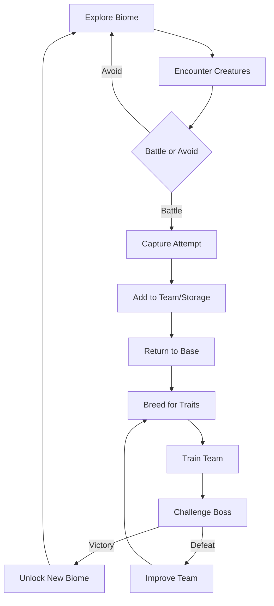

# The Ark: Creature Collection RPG

**Genre:** Action RPG / Monster Collecting Hybrid
**Tagline:** *Explore. Collect. Breed. Conquer.*

---

## Vision Statement

The Ark puts players in the boots of a Keeper - an explorer who ventures into dangerous biomes, captures creatures with unique genetics, breeds them for optimal traits, and challenges powerful bosses. Unlike traditional monster collectors where breeding is random stats, The Ark's creatures have real genetic inheritance that rewards understanding of inheritance patterns.

**Core Fantasy:** Being an explorer who masters genetics to build the ultimate creature team.

**Inspirations:** Pokémon's collection + Monster Hunter's exploration + Shin Megami Tensei's fusion depth

---

## Core Identity

```
You are the Keeper. The wilds are your domain.
Every creature you capture has unique genetics.
Every breeding decision shapes your team.
Every boss demands the right adaptation.
```

### What Makes It Different

| Aspect | Traditional Monster Collector | The Ark |
|--------|------------------------------|---------|
| Player | Absent/implied | Active avatar in world |
| Breeding | Random IVs/stats | Real diploid inheritance |
| Exploration | Linear routes | Open world biomes |
| Combat | Type matchups | Genetic trait matchups |
| Progression | Badges/gyms | Boss conquests + breeding mastery |
| World | Static | Living ecosystem |

---

## Core Loop



### Exploration Phase

1. **Venture Out** - Your Keeper explores dangerous biomes
2. **Real-time Encounters** - Creatures live in the ecosystem
3. **Tactical Capture** - Weaken and trap valuable genetics
4. **Gather Resources** - Find breeding items, equipment
5. **Discover Secrets** - Hidden areas, rare spawns, lore

### Breeding Phase

1. **Return to Ark** - Your home base
2. **Select Parents** - Choose from captured creatures
3. **Predict Offspring** - View inheritance probability
4. **Breed** - Create offspring with inherited genes
5. **Develop** - Raise and train for your team

### Boss Challenge Phase

1. **Scout Boss** - Learn its genetic strengths/weaknesses
2. **Build Counter-Team** - Breed creatures with right traits
3. **Challenge** - Multi-phase boss battle
4. **Victory** - Unlock new areas, rare genetics
5. **Or Retreat** - Analyze failure, improve, return

---

## The Keeper (Player Avatar)

### Keeper Abilities

Your character has their own progression:

| Ability | Effect | Unlock |
|---------|--------|--------|
| **Capture Mastery** | Better catch rates | Experience |
| **Genetic Insight** | See more trait details | Research |
| **Quick Swap** | Change active creature faster | Training |
| **Bonding** | Creature loyalty bonuses | Time spent |
| **Survival Skills** | Navigate hazards | Exploration |

### Keeper Equipment

| Slot | Examples | Effect |
|------|----------|--------|
| **Capture Tool** | Basic Net, Gene Trap, Pheromone Lure | Capture methods |
| **Armor** | Light Scout, Heavy Explorer | Biome survival |
| **Utility** | Binoculars, Gene Scanner, Map | Information gathering |
| **Companion Slot** | Active creature following you | Combat partner |

### Keeper Actions in Field

- **Direct Movement** - WASD/controller exploration
- **Stealth** - Avoid or ambush creatures
- **Scan** - Analyze creature before engaging
- **Command** - Direct companion creature
- **Interact** - Environment puzzles, NPCs, resources

---

## The Collection

### Creature Discovery

Each area has unique creature populations:

```
═══════════════════════════════════════════════════════
  AREA: SCORCHED WASTES
  Biome: Desert   Temperature: Hot   Danger: High
═══════════════════════════════════════════════════════
  
  NATIVE CREATURES:
  
  ┌──────────────────────────────────────────────────┐
  │  SANDSKITTER  -  Common                          │
  │  Typical Genetics: Heat tolerance, water storage │
  │  Collection Status: ████████░░ 82% cataloged    │
  └──────────────────────────────────────────────────┘
  
  ┌──────────────────────────────────────────────────┐
  │  DUNERUNNER  -  Uncommon                         │
  │  Typical Genetics: Speed, heat tolerance         │
  │  Collection Status: ███░░░░░░░ 34% cataloged    │
  └──────────────────────────────────────────────────┘
  
  ┌──────────────────────────────────────────────────┐
  │  HEATWYRM  -  Rare                               │
  │  Typical Genetics: Extreme heat, burrowing       │
  │  Collection Status: █░░░░░░░░░ 12% cataloged    │
  │  NOTE: May carry unique HEAT_IMMUNITY gene       │
  └──────────────────────────────────────────────────┘

═══════════════════════════════════════════════════════
```

### Genetic Cataloging

Not just catching - understanding:

**Species Record:**
```
SPECIES: DUNERUNNER
Scientific: Velocimimus desertus
───────────────────────────────────────
GENETIC PROFILE (Population Average):

  HEAT_TOLERANCE:     ████████░░  0.81 ± 0.12
  COLD_TOLERANCE:     ██░░░░░░░░  0.23 ± 0.08
  SPEED:              ███████░░░  0.72 ± 0.15
  WATER_EFFICIENCY:   █████░░░░░  0.54 ± 0.18
  PLANT_DIGESTION:    ████░░░░░░  0.41 ± 0.14
  MEAT_DIGESTION:     ██████░░░░  0.63 ± 0.11

RARE VARIANTS DISCOVERED:
  • "Albino" - Low pigmentation gene (1 specimen)
  • "Giant" - High size gene (3 specimens)  
  • "Swift" - 0.95+ speed gene (2 specimens)

BREEDING NOTES:
  • Speed is incomplete dominant
  • Heat tolerance codominant with cold tolerance
  • Size inherits from larger parent 70% of time
───────────────────────────────────────
```

### Collection Goals

**Completionist:**
- Catalog all species
- Find all rare variants
- Document full genetic range

**Breeder:**
- Create optimal trait combinations
- Achieve trait maximums
- Breed unique hybrids

**Survivor:**
- Build crisis-ready roster
- Maintain genetic diversity
- Cover all trait needs

---

## Breeding System

### The Breeding Lab

Your central facility for genetic work:

```
╔═══════════════════════════════════════════════════════════╗
║                    BREEDING LAB                           ║
╠═══════════════════════════════════════════════════════════╣
║                                                           ║
║  PARENT A: SWIFT (Dunerunner ♂)                          ║
║  ┌─────────────────────────────────────────────────────┐ ║
║  │ Speed: 0.91  Heat: 0.78  Size: 0.45  Health: 0.82  │ ║
║  └─────────────────────────────────────────────────────┘ ║
║                         ↓ × ↓                             ║
║  PARENT B: EMBER (Heatwyrm ♀)                            ║
║  ┌─────────────────────────────────────────────────────┐ ║
║  │ Speed: 0.34  Heat: 0.96  Size: 0.71  Health: 0.67  │ ║
║  └─────────────────────────────────────────────────────┘ ║
║                                                           ║
║  ════════════════════════════════════════════════════    ║
║  PREDICTED OFFSPRING:                                     ║
║                                                           ║
║  Speed:  ████████░░  0.55 - 0.72  (blended)              ║
║  Heat:   █████████░  0.82 - 0.91  (high inheritance)     ║
║  Size:   █████░░░░░  0.48 - 0.65  (variable)             ║
║  Health: ██████░░░░  0.58 - 0.77  (some risk)            ║
║                                                           ║
║  SPECIAL: 15% chance of inheriting HEAT_IMMUNITY         ║
║           (rare recessive from EMBER's lineage)          ║
║                                                           ║
║  [BREED]  [SWAP PARENTS]  [VIEW DETAILS]  [CANCEL]       ║
║                                                           ║
╚═══════════════════════════════════════════════════════════╝
```

### Inheritance Mechanics

Real genetics, visible to player:

**Dominance Types:**
| Type | Behavior | Example |
|------|----------|---------|
| Complete Dominant | One allele masks other | Coloration |
| Incomplete Dominant | Blend of both | Speed |
| Codominant | Both express | Pattern markings |
| Recessive | Only expresses if homozygous | Rare abilities |

**Breeding Strategy Examples:**

*Goal: Maximize Speed*
```
Gen 1: Speed 0.65 × Speed 0.72 → Offspring 0.68 avg
Gen 2: Speed 0.71 × Speed 0.74 → Offspring 0.73 avg
Gen 3: Speed 0.76 × Speed 0.78 → Offspring 0.77 avg
Gen 4: Speed 0.79 × Speed 0.82 → Offspring 0.81 avg
...
Gen 10: Speed 0.91 × Speed 0.93 → BREAKTHROUGH: 0.95!
```

*Goal: Combine Heat + Cold Tolerance*
```
Heat-specialist (Heat 0.9, Cold 0.2) 
  × 
Cold-specialist (Heat 0.2, Cold 0.9)
  = 
Offspring options:
  - Balanced (Heat 0.5, Cold 0.5) - most common
  - Heat-leaning (Heat 0.7, Cold 0.4)
  - Cold-leaning (Heat 0.4, Cold 0.7)
  - Rare: High both (Heat 0.6, Cold 0.6) - genetic jackpot!
```

### Genetic Library Management

Storage is limited. Decisions matter:

**Capacity:**
- Starting: 20 creatures
- Expandable through progression
- Maximum: 100+ creatures

**Release vs Keep:**
- Releasing returns creature to wild
- Keeps genetic data in catalog
- Can re-catch later (different individual)

**Breeding Priority:**
- Limited breeding slots per cycle
- Choose which pairings matter most
- Balance optimization vs. diversity

---

## Boss System

### Boss Design Philosophy

Bosses are genetically extreme creatures that test your breeding mastery:

- Each boss has **exaggerated genetic traits** (e.g., 0.95+ in key stats)
- Victory requires **counter-breeding** - creating creatures that exploit weaknesses
- Bosses guard **new biomes** and **rare genetic material**

### Boss Types

#### Biome Guardians

Each major biome has a guardian boss:

**INFERNOX - Guardian of Scorched Wastes**
```
╔═════════════════════════════════════════════════════════╗
║  🔥  BOSS: INFERNOX                                      ║
║  Location: Volcanic Caldera (Scorched Wastes)           ║
╠═════════════════════════════════════════════════════════╣
║                                                          ║
║  GENETIC PROFILE:                                        ║
║  • Heat Tolerance:  ██████████  0.98 (EXTREME)          ║
║  • Attack Power:    ████████░░  0.82                    ║
║  • Speed:           ███░░░░░░░  0.31 (WEAKNESS)         ║
║  • Cold Tolerance:  █░░░░░░░░░  0.08 (VULNERABILITY)    ║
║                                                          ║
║  ABILITIES:                                              ║
║  • Flame Aura - Damages low heat-tolerance creatures    ║
║  • Magma Pool - Area denial, forces movement           ║
║  • Eruption - High damage phase 2 attack               ║
║                                                          ║
║  RECOMMENDED COUNTER-GENETICS:                          ║
║  • Speed: 0.7+ to dodge slow attacks                    ║
║  • Heat Tolerance: 0.6+ to survive aura                 ║
║  • Cold attacks if available (massive bonus damage)     ║
║                                                          ║
║  REWARDS:                                                ║
║  • Unlocks: Frozen Peaks biome                          ║
║  • Rare Gene: HEAT_IMMUNITY (for breeding)              ║
║  • Equipment: Fireproof Cloak                           ║
║                                                          ║
╚═════════════════════════════════════════════════════════╝
```

**GLACIOTH - Guardian of Frozen Peaks**
- Extreme cold tolerance, slow but devastating
- Weakness: Heat, speed
- Unlocks: Deep Caverns

**VENOMAW - Guardian of Murky Swamps**
- Extreme toxin production, regeneration
- Weakness: Size, toxin resistance
- Unlocks: Volcanic Isle

**SHADOWFANG - Guardian of Deep Caverns**
- Extreme speed, stealth, critical hits
- Weakness: Size, perception
- Unlocks: Final area

### Boss Battle Mechanics

#### Phase System

Bosses have multiple phases:

```
INFERNOX BATTLE - Phase 2 of 3
────────────────────────────────

  INFERNOX                        YOUR TEAM
  HP: ████████░░ 340/500          SWIFT: ████████░░ 72/90
                                  EMBER: ██████████ 85/85
  Status: ENRAGED                 FROST: ██░░░░░░░░ 18/75 ⚠️

  PHASE 2 ABILITY: Magma pools appearing!
  
  [FROST is taking heat damage! Swap out?]
  
  ACTIONS:
  ┌──────────┬──────────┬──────────┬──────────┐
  │ ATTACK   │ DEFEND   │ SWAP     │ ITEM     │
  │ Swift    │ Reduce   │ Change   │ Use      │
  │ Strike   │ Damage   │ Creature │ Healing  │
  └──────────┴──────────┴──────────┴──────────┘
```

#### Genetic Matchups

Combat effectiveness based on traits:

| Your Trait | Boss Weakness | Effect |
|------------|---------------|--------|
| High Speed vs Low Speed | First strike, dodge chance |
| High Attack vs Low Defense | Bonus damage |
| Counter-element | Massive damage bonus |
| Matching element | Reduced damage taken |

### Boss Preparation

The breeding loop feeds directly into boss challenges:

1. **Scout Boss** - Observe from safe distance, learn patterns
2. **Analyze Genetics** - Identify weaknesses (requires Gene Scanner)
3. **Breed Counter-Team** - Create creatures with exploiting traits
4. **Train Team** - Level up, improve stats
5. **Challenge** - Face the boss
6. **Learn and Adapt** - If defeated, use knowledge to breed better

### World Bosses

Rare, roaming super-bosses:

**THE PROGENITOR**
- Legendary creature with balanced extreme stats
- Roams between biomes
- Defeating it grants unique "Progenitor Gene" - enhances all breeding
- Only appears after all Guardians defeated

### Boss Rewards

| Reward Type | Examples |
|-------------|----------|
| **Biome Unlock** | Access new areas with unique creatures |
| **Rare Genetics** | Boss-exclusive genes for breeding |
| **Equipment** | Keeper gear, capture tools |
| **Resources** | Breeding accelerators, rare items |
| **Lore** | World history, genetic secrets |

---

## Progression System

### Area Unlocking

Progress by surviving crises and exploring:

```
WORLD MAP
─────────

  [VERDANT MEADOWS]     [SCORCHED WASTES]     [FROZEN PEAKS]
      ✓ Complete           ✓ Unlocked            🔒 Locked
                                               (Survive Ice Age)
           │                    │                    │
           └────────────────────┼────────────────────┘
                                │
                        [THE ARK - Home Base]
                                │
           ┌────────────────────┼────────────────────┐
           │                    │                    │
  [MURKY SWAMPS]         [DEEP CAVERNS]        [VOLCANIC ISLE]
     🔒 Locked             🔒 Locked              🔒 Locked
  (Find Amphibian)     (Defeat Predator)      (Heat Immune)
```

### Ark Upgrades

Improve your facilities:

| Upgrade | Effect | Unlock |
|---------|--------|--------|
| **Breeding Lab II** | See more inheritance detail | 10 successful breeds |
| **Expanded Shelter** | +10 creature capacity | Survive 5 crises |
| **Genetic Archive** | Store genetics without creature | Catalog 50 species |
| **Climate Dome** | Protect vulnerable during crisis | Complete Meadows |
| **Breeding Accelerator** | Faster breeding cycles | 25 successful breeds |

### Achievements

**Collection:**
- "Geneticist" - Catalog 100 unique genetic profiles
- "Rare Hunter" - Find 10 rare gene variants
- "Complete Archive" - Catalog all species in an area

**Breeding:**
- "Trait Master" - Achieve 0.95+ in any trait
- "Hybrid Vigor" - Create offspring better than both parents
- "Genetic Engineer" - Breed creature with 4+ maxed traits

**Survival:**
- "Untouchable" - Survive crisis with zero casualties
- "Adaptation" - Overcome crisis you were unprepared for
- "Ark Keeper" - Maintain 50+ creature collection for 20 crises

---

## Creature Battles

Optional competitive element using genetic matchups:

### Battle System

Not type-matchups - trait matchups:

```
BATTLE: SWIFT vs CRUSHER
─────────────────────────

  SWIFT (Dunerunner)          CRUSHER (Rockhide)
  Speed: 0.91                 Speed: 0.34
  Attack: 0.45                Attack: 0.78
  Defense: 0.38               Defense: 0.89
  Stamina: 0.67               Stamina: 0.72

  MATCHUP ANALYSIS:
  • SWIFT attacks first (speed advantage)
  • SWIFT's attacks barely penetrate (low atk vs high def)
  • CRUSHER hits hard when it connects
  • SWIFT can dodge (speed vs speed check)

  PREDICTION: 55% SWIFT (speed advantage)
              45% CRUSHER (if it lands hits)

  [FIGHT]  [SWAP CREATURE]  [FORFEIT]
```

### Battle Genetics

Key combat genes:

| Gene | Effect |
|------|--------|
| JAW_STRENGTH | Attack power |
| HIDE_THICKNESS | Defense |
| LOCOMOTION | Speed, dodge chance |
| SIZE | Health pool |
| AGGRESSION | Critical hit chance |
| PAIN_SENSITIVITY | Damage taken (inverse) |

### Battle Modes

**Wild Encounters:**
- Must battle to capture some creatures
- Weaken without killing

**Trainer Battles:**
- PvP with other players
- Show off breeding achievements

**Crisis Combat:**
- Fight predator threats
- Defend territory

---

## Creature Contests

Beyond combat, contests reward diverse breeding strategies:

### Contest Philosophy

Combat breeding optimizes for speed, attack, defense. But contests demand **different trait combinations**, encouraging players to maintain diverse genetic lines.

### Contest Types

#### 🏃 Speed Trials

```
╔═════════════════════════════════════════════════════════════╗
║  SPEED TRIAL: Desert Dash                                   ║
╠═════════════════════════════════════════════════════════════╣
║  Course: Scorched Wastes - 500m sprint                      ║
║  Hazards: Sand traps, heat zones                            ║
║                                                             ║
║  KEY GENETICS:                                              ║
║  • LOCOMOTION: Primary speed factor                         ║
║  • HEAT_TOLERANCE: Survive heat zones without slowing       ║
║  • STAMINA: Maintain speed throughout                       ║
║                                                             ║
║  YOUR ENTRY: SWIFT (Dunerunner)                             ║
║  Projected Time: 42.3 seconds (2nd place estimate)          ║
║                                                             ║
║  [ENTER]  [CHANGE CREATURE]  [VIEW COMPETITORS]             ║
╚═════════════════════════════════════════════════════════════╝
```

**Variants:**
- Terrain-specific races (desert, ice, swamp)
- Obstacle courses requiring agility
- Endurance marathons (stamina-focused)

---

#### 💪 Strength Challenges

| Challenge | Key Genetics | Description |
|-----------|--------------|-------------|
| **Boulder Push** | SIZE, JAW_STRENGTH | Move heavy object fastest |
| **Tug of War** | SIZE, STAMINA | Outlast opponent |
| **Digging Contest** | JAW_STRENGTH, STAMINA | Excavate deepest hole |

---

#### 🎨 Beauty Pageants

Judged on aesthetic genetics:

```
BEAUTY CONTEST: Verdant Showcase
────────────────────────────────

JUDGING CRITERIA:
┌─────────────────────────────────────────────────────────────┐
│  COLORATION (30%)                                           │
│  • Vibrant pigmentation scores high                         │
│  • Rare color variants get bonus                            │
│                                                             │
│  SYMMETRY (25%)                                             │
│  • Based on morphology gene balance                         │
│                                                             │
│  SIZE CLASS (20%)                                           │
│  • Optimal size for species type                            │
│                                                             │
│  COAT QUALITY (25%)                                         │
│  • FUR_DENSITY, health indicators                           │
└─────────────────────────────────────────────────────────────┘

YOUR ENTRY: AURORA (Meadowleaper)
  Coloration: ████████░░ 8.2/10
  Symmetry:   ███████░░░ 7.5/10
  Size:       █████████░ 9.1/10
  Coat:       ██████░░░░ 6.3/10
  
  TOTAL: 7.8/10 (Estimated 3rd place)
```

---

#### 🧠 Intelligence Tests

| Challenge | Key Genetics | Description |
|-----------|--------------|-------------|
| **Maze Run** | SPATIAL_MEMORY, PERCEPTION | Navigate complex maze |
| **Scent Trail** | SCENT_DETECTION | Follow hidden trail |
| **Problem Solving** | Multiple behavioral genes | Multi-step puzzle |

---

#### 🌡️ Survival Challenges

Test environmental adaptation:

```
SURVIVAL CHALLENGE: Frozen Gauntlet
───────────────────────────────────

Complete course through extreme cold zone.
Creatures must survive AND finish quickly.

REQUIREMENTS:
  • COLD_TOLERANCE: 0.6+ minimum to survive
  • LOCOMOTION: Affects completion time
  • FAT_STORAGE: Reduces cold damage taken
  • FUR_DENSITY: Additional cold resistance

DISQUALIFICATION:
  Creatures below 0.5 cold tolerance will be
  eliminated before finishing.

YOUR ROSTER ANALYSIS:
  ✓ FROST - Can complete (Cold: 0.82)
  ✓ EMBER - Risky (Cold: 0.61)
  ✗ BLAZE - Cannot survive (Cold: 0.23)
```

---

### Contest Rewards

| Reward | Source |
|--------|--------|
| **Exclusive Genes** | First place in championship |
| **Breeding Items** | Placement prizes |
| **Cosmetics** | Ribbons, trophies for display |
| **Currency** | Entry to premium contests |
| **Titles** | "Speed Champion", "Beauty Queen" |

### Contest Seasons

Regular rotation keeps breeding goals fresh:

```
CONTEST CALENDAR
────────────────

CURRENT SEASON: Summer Games
  Week 1: Speed Trials (Desert)
  Week 2: Survival Challenge (Heat)
  Week 3: Beauty Pageant (Tropical)
  Week 4: CHAMPIONSHIP (Combined)

NEXT SEASON: Winter Festival
  Focus: Cold tolerance, endurance, beauty
```

### Strategic Breeding for Contests

**The Meta Problem:** Combat-optimized creatures dominate everything.

**The Solution:** Contests require **incompatible trait combinations**.

| Contest Type | Optimal Build | Combat Build Comparison |
|--------------|---------------|-------------------------|
| Speed Trial | High speed, low size | Combat wants size for HP |
| Beauty | High aesthetics, balanced | Combat ignores aesthetics |
| Survival | Extreme tolerance | Combat balances tolerances |
| Intelligence | Behavioral genes | Combat ignores these |

**Result:** Players must breed specialist contest creatures OR accept suboptimal performance. This drives collection diversity.

---

## UI/UX Design

### Main Hub

```
┌─────────────────────────────────────────────────────────────┐
│  THE ARK  │  Creatures: 34/50  │  Next Crisis: 3 days       │
├─────────────────────────────────────────────────────────────┤
│                                                             │
│   ┌───────────┐  ┌───────────┐  ┌───────────┐              │
│   │           │  │           │  │           │              │
│   │  EXPLORE  │  │   BREED   │  │  PREPARE  │              │
│   │           │  │           │  │           │              │
│   └───────────┘  └───────────┘  └───────────┘              │
│                                                             │
│   ┌───────────┐  ┌───────────┐  ┌───────────┐              │
│   │           │  │           │  │           │              │
│   │ COLLECTION│  │  CATALOG  │  │  UPGRADE  │              │
│   │           │  │           │  │           │              │
│   └───────────┘  └───────────┘  └───────────┘              │
│                                                             │
├─────────────────────────────────────────────────────────────┤
│  ALERTS:                                                    │
│  [!] HEAT WAVE incoming in 3 days - prepare heat-tolerant   │
│  [i] EMBER ready to breed again                             │
│  [✓] New species discovered: THORNBACK                      │
└─────────────────────────────────────────────────────────────┘
```

### Key Screens

1. **Collection View** - Grid of all owned creatures
2. **Creature Detail** - Deep genetics view for individual
3. **Breeding Lab** - Parent selection and prediction
4. **World Map** - Area selection and status
5. **Crisis Center** - Upcoming and active crises
6. **Genetic Catalog** - Species documentation

---

## Engine Integration

### Systems Fully Utilized

| Engine System | The Ark Use |
|---------------|-------------|
| **Genetics (88 genes)** | Core creature differentiation |
| **Behavior AI** | Wild creature behavior during capture |
| **Combat** | Battle system foundation |
| **Environment** | Crisis conditions |
| **Coevolution** | Wild population adaptation over time |

### Additional Systems Needed

| System | Purpose | Complexity |
|--------|---------|------------|
| **Collection Database** | Track owned creatures, catalog | Medium |
| **Breeding Predictor** | Calculate inheritance probability | Medium |
| **Crisis Generator** | Create and manage crisis events | Medium |
| **Capture Mechanics** | Wild encounter resolution | Low |
| **Battle System** | PvP/PvE combat | Medium |
| **Area Management** | Region unlock and discovery | Low |
| **Achievement Tracker** | Goal completion | Low |

---

## Multiplayer Features

### Trading

Exchange creatures with real genetic value:

```
TRADE OFFER FROM: Player_Breeder
─────────────────────────────────

OFFERING:                    REQUESTING:
BLAZE (Heatwyrm)            Any creature with
Heat: 0.94                  Cold Tolerance > 0.8
Speed: 0.41                 
Rare: HEAT_IMMUNITY gene    

[ACCEPT]  [COUNTER]  [DECLINE]
```

### Competitive Battling

- Ranked matches using bred creatures
- Genetics visible to opponent (no hidden stats)
- Strategy = breeding + battle tactics

### Cooperative Crises

- Join friends to face mega-crises
- Pool genetic resources
- Shared rewards

### Leaderboards

- Breeding achievements (highest traits)
- Collection completion
- Crisis survival streaks
- Battle rankings

---

## Narrative Elements

### The Premise

*The world's ecosystems have fractured into isolated biomes, each dominated by a powerful Guardian - creatures of extreme genetic potential. As a Keeper, you venture from The Ark to explore these wild territories, capture creatures, master genetics, and ultimately challenge the Guardians to reunite the world.*

### Story Campaign

**Act 1: The First Steps**
- Create your Keeper, establish The Ark
- Explore Verdant Meadows (tutorial biome)
- Learn capture, breeding, combat basics
- Defeat first mini-boss, unlock second biome

**Act 2: The Guardians**
- Challenge biome Guardians in order of difficulty
- Each victory unlocks new area and rare genetics
- Build relationships with other Keepers (NPCs)
- Discover the mystery of the Progenitor

**Act 3: Reunification**
- All Guardians defeated, The Progenitor appears
- Must breed ultimate team combining all rare genetics
- Final boss requires mastery of all game systems
- Multiple endings based on choices and completion

### World Lore

Discover history through exploration:

> *The Heatwyrm was once common across all regions. When the Great Sundering separated the biomes, most populations perished in the sudden climate shifts. Only those with the rare HEAT_IMMUNITY gene survived in what became the Scorched Wastes. Today, finding a Heatwyrm with this gene is considered a breeding triumph - and essential for challenging INFERNOX.*

### NPC Keepers

Meet other characters in your journey:

- **SILVA** - Expert breeder, teaches advanced genetics
- **MAGNUS** - Battle specialist, trains your combat skills
- **ECHO** - Explorer who maps secret areas
- **THE ARCHIVIST** - Keeper of genetic knowledge, reveals lore

---

## Target Audience

**Primary:** Players who enjoy:
- Action RPGs with exploration (Monster Hunter, Pokémon Legends)
- Collection and breeding depth
- Boss challenges that require preparation
- Character progression alongside creature development

**Secondary:**
- Pokémon fans wanting active gameplay + breeding depth
- Monster Hunter fans wanting creature collection
- RPG players who enjoy build crafting

**Not For:**
- Players wanting pure action without management
- Those who dislike grinding/breeding loops
- Players expecting traditional turn-based monster battles

---

## Unique Selling Points

1. **Active Exploration** - You're in the world, not just menus
2. **Real Genetics** - Breeding has actual depth, not random stats
3. **Boss-Driven Progression** - Guardians give clear goals and meaningful rewards
4. **Keeper + Creatures** - Both you and your team develop
5. **Living Ecosystem** - The world runs on the simulation engine
6. **Breeding = Strategy** - Counter-build bosses through genetics

---

## Risk Assessment

| Risk | Mitigation |
|------|------------|
| Genetics too complex | Clear UI, prediction tools, gradual learning |
| Crisis frustration | Difficulty scaling, retry options |
| Collection grind | Meaningful progression, varied activities |
| Lost rare genetics devastating | Genetic archive backup, re-encounter chance |
| Battle balance | Genetics visible, skill + breeding both matter |

---

## Development Priority

**High Priority:**
- Collection and catalog system
- Breeding lab with prediction
- Crisis system (events + survival)
- Core creature capture

**Medium Priority:**
- Battle system
- Area unlock progression
- Trading system
- Achievement tracking

**Lower Priority:**
- Competitive multiplayer
- Story campaign
- Advanced breeding UI
- Leaderboards

---

## See Also

- [[README]] - Game concepts overview
- [[genesis-god-sim]] - Alternative: god-game with scenario objectives
- [[dominion-tribal]] - Alternative: character-driven tribal gameplay
- [[../future/README]] - Engine development roadmap
- [[../technical/design/coevolution]] - Underlying genetics system
