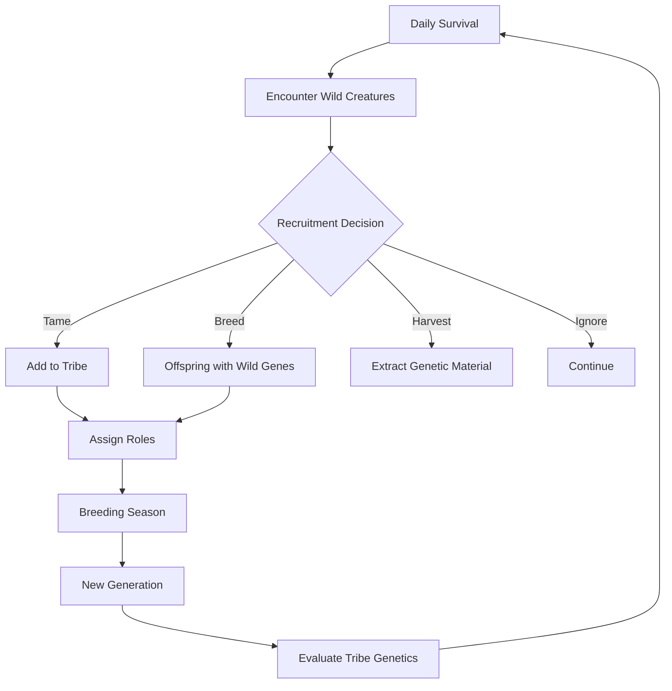

# Dominion: Tribal Gene Cultivation

**Genre:** Colony Sim / Breeding Game Hybrid
**Tagline:** *Every creature has a name. Every gene has a story. Every generation matters.*

---

## Vision Statement

Dominion puts players in charge of a small tribe of named creatures struggling to survive and thrive across generations. Unlike god games where populations are abstract numbers, every creature in your tribe is an individual with personality, lineage, and unique genetics. Your role is to guide breeding decisions, recruit valuable traits from wild creatures, and ensure your tribe's genetic legacy survives whatever challenges arise.

**Core Fantasy:** Being the tribal elder who shapes a bloodline across generations.

**Inspirations:** Rimworld's character attachment + Pokémon's breeding depth + Crusader Kings' dynasty management

---

## Core Identity

```
You dont control evolution from above.
You guide a tribe from within.
Every creature has a name. Every death matters.
Every offspring carries their parents legacy.
```

### What Makes It Different

| Aspect | God Games | Dominion |
|--------|-----------|----------|
| Scale | Thousands of creatures | 5-30 named individuals |
| Attachment | Statistical | Personal |
| Deaths | Expected attrition | Meaningful loss |
| Breeding | Population-level | Individual matchmaking |
| Time | Accelerated | Real-time with generation gaps |
| Perspective | Omniscient | Tribal leader |

---

## Core Loop



### Daily Cycle

1. **Survival Tasks** - Assign tribe members to forage, guard, scout
2. **Encounters** - Wild creatures, rival tribes, environmental events
3. **Decisions** - Recruitment, breeding, territory, conflicts
4. **Resolution** - See results of choices, manage consequences

### Generational Cycle

1. **Breeding Season** - Select mating pairs from tribe
2. **Birth** - New creatures inherit genes from parents
3. **Maturation** - Young develop traits based on genetics
4. **Elder Transition** - Old creatures die, knowledge passes on
5. **Evaluation** - Assess tribe's genetic progress

---

## The Tribe

### Tribe Composition

**Ideal Size:** 8-20 creatures
**Minimum Viable:** 5 creatures (genetic bottleneck risk)
**Maximum Practical:** 30 creatures (management complexity)

### Individual Creatures

Each tribe member has:

| Attribute | Source | Function |
|-----------|--------|----------|
| **Name** | Auto-generated or player-assigned | Identity, attachment |
| **Genetics** | 88 genes from engine | Capabilities, traits |
| **Personality** | Derived from behavior genes | Autonomous decisions |
| **Relationships** | Dynamic based on interactions | Mating preferences, conflicts |
| **Role** | Player-assigned | Daily task allocation |
| **Lineage** | Family tree tracking | Dynasty visualization |

### Example Tribe Member

```
═══════════════════════════════════════
  WHISPER  -  Generation 4
  Role: Scout    Age: 3.2 seasons
═══════════════════════════════════════
  
  LINEAGE:
  ├─ Father: SWIFT (Gen 3, deceased)
  │  └─ Known for: Speed genes
  └─ Mother: AMBER (Gen 3, elder)
     └─ Known for: Color vision
  
  NOTABLE GENETICS:
  • Speed: ████████░░ 0.82 (inherited: SWIFT)
  • Color Vision: ███████░░░ 0.71 (inherited: AMBER)  
  • Toxin Tolerance: ███░░░░░░░ 0.31 (needs improvement)
  
  PERSONALITY:
  • Exploratory (high curiosity gene)
  • Solitary (low social gene)
  • Cautious (high pain sensitivity)
  
  RELATIONSHIPS:
  • Bonded with: MOSS (sibling)
  • Rival: CRAG (competition for mate)
  • Potential mate: FERN (compatible genetics)
  
═══════════════════════════════════════
```

---

## Genetic Recruitment

The heart of Dominion: acquiring new genetic material to strengthen your tribe.

### Recruitment Methods

#### 1. Taming (Peaceful)

**Process:**
1. Scout encounters wild creature with desirable trait
2. Initiate approach (uses scent system for compatibility check)
3. Offer resources (food sharing builds trust)
4. Gradual trust building over multiple encounters
5. Wild creature joins tribe

**Advantages:**
- Full creature joins (all genes available)
- No conflict
- Creature brings knowledge (explored territory)

**Disadvantages:**
- Slow (multiple encounters required)
- May fail (incompatible personalities)
- Wild creature may have unwanted traits too

**Factors Affecting Success:**
- Social genes of tribe member doing taming
- Personality compatibility
- Resource offerings
- Time invested

---

#### 2. Breeding Invitation (Diplomatic)

**Process:**
1. Identify wild creature with specific valuable trait
2. Send tribe member as mating partner
3. Offspring born (stays with tribe or wild parent)
4. Offspring has chance to inherit target trait

**Advantages:**
- Targeted genetics acquisition
- Lower commitment than full taming
- Can choose which parent raises offspring

**Disadvantages:**
- Genetics split (offspring may not inherit target trait)
- Mating partner unavailable for tribe breeding that season
- Wild parent may keep offspring

**Strategic Use:**
Best for single valuable traits when you don't want entire wild genome.

---

#### 3. Gene Harvesting (Ruthless)

**Process:**
1. Wild creature dies (natural causes, predation, or... hunting)
2. Extract genetic material from corpse
3. Use in next breeding cycle as "donor"

**Advantages:**
- Guaranteed specific genes
- No behavioral integration issues
- Can harvest from rivals/enemies

**Disadvantages:**
- Morally questionable (affects tribe morale?)
- Requires death of target
- May escalate conflicts with wild populations

**Moral Choice:**
Do you wait for natural death, or hunt valuable specimens?

---

#### 4. Offspring Adoption (Opportunistic)

**Process:**
1. Find abandoned young (parent death, rival tribe attack)
2. Bring to tribe for raising
3. Young creature grows up as tribe member

**Advantages:**
- No conflict required
- Young creature bonds strongly
- Blank slate for role assignment

**Disadvantages:**
- Unknown genetics until maturation
- Rare opportunity
- May have hidden health issues

---

### Wild Creature Evaluation

When encountering wild creatures, evaluate:

```
┌─────────────────────────────────────────────────────┐
│  WILD ENCOUNTER: Unknown Female                     │
├─────────────────────────────────────────────────────┤
│  OBSERVABLE TRAITS:                                 │
│  • Size: Large (high SIZE gene likely)              │
│  • Coloration: Bright (high pigmentation)           │
│  • Movement: Fast (speed genes visible)             │
│  • Behavior: Aggressive (hunting instinct?)         │
│                                                     │
│  ESTIMATED GENETICS: (based on observation)         │
│  • Speed: High (observed)                           │
│  • Size: High (observed)                            │
│  • Aggression: High (observed)                      │
│  • ???: Unknown traits require closer inspection    │
│                                                     │
│  RECRUITMENT OPTIONS:                               │
│  [Approach for Taming] - Risk: Medium               │
│  [Send Mate] - CRAG willing, compatible             │
│  [Track for Later] - Mark for future               │
│  [Ignore]                                           │
└─────────────────────────────────────────────────────┘
```

---

## Tribal Roles

### Role Assignment

Creatures are assigned roles based on their genetics and player choice:

| Role | Best Genetics | Function |
|------|---------------|----------|
| **Forager** | Plant digestion, spatial memory | Gather food from plants |
| **Hunter** | Speed, meat digestion, aggression | Hunt prey for food |
| **Scout** | Speed, perception, exploration | Discover territory, find recruits |
| **Guardian** | Size, combat genes, pain tolerance | Defend tribe from threats |
| **Breeder** | Fertility, health, valuable genes | Priority mating partner |
| **Elder** | Experience, any genetics | Pass knowledge, settle disputes |

### Role Effectiveness

```cpp
// Pseudocode for role effectiveness
float calculateForagerEffectiveness(Creature& c) {
    float plantDigestion = c.getGene(PLANT_DIGESTION_EFFICIENCY);
    float spatialMemory = c.getGene(SPATIAL_MEMORY);
    float speed = c.getGene(LOCOMOTION);
    
    return (plantDigestion * 0.5f) + (spatialMemory * 0.3f) + (speed * 0.2f);
}
```

### Emergent Specialization

Over generations, your breeding choices naturally create castes:

**Generation 1:** General-purpose creatures
**Generation 10:** Some are noticeably better foragers
**Generation 25:** Distinct forager lineage emerging
**Generation 50:** Two castes: Fast scouts and Strong guardians

*This isn't forced - it emerges from player breeding decisions and natural selection.*

---

## Breeding System

### Mating Selection

Each breeding season, choose pairings:

```
═══════════════════════════════════════════════════════
          BREEDING SEASON - Generation 12
═══════════════════════════════════════════════════════

  AVAILABLE FEMALES:        AVAILABLE MALES:
  ┌──────────────────┐     ┌──────────────────┐
  │ AMBER (Elder)    │     │ CRAG (Prime)     │
  │ FERN (Prime)     │     │ SWIFT (Young)    │
  │ MOSS (Young)     │     │ STONE (Prime)    │
  └──────────────────┘     └──────────────────┘

  RECOMMENDED PAIRING:
  FERN + CRAG
  • Genetic compatibility: 87%
  • Combined strengths: Speed + Size
  • Risk: Both carry low toxin tolerance
  • Expected offspring: 2-3

  ALTERNATIVE PAIRING:
  FERN + SWIFT
  • Genetic compatibility: 62% (siblings share genes)
  • Combined strengths: Double speed inheritance
  • Risk: Inbreeding coefficient 0.25
  • Expected offspring: 2-3

  [Confirm Pairing] [View Details] [Auto-Assign]

═══════════════════════════════════════════════════════
```

### Inheritance Preview

Before confirming pairing, see likely outcomes:

| Trait | Parent A | Parent B | Offspring Range |
|-------|----------|----------|-----------------|
| Speed | 0.82 | 0.71 | 0.65 - 0.88 |
| Size | 0.45 | 0.78 | 0.40 - 0.82 |
| Toxin Tolerance | 0.31 | 0.22 | 0.18 - 0.35 |

**Dominance Effects:**
- Speed: Incomplete dominance (blend)
- Size: Codominance (may be either extreme)
- Coloration: Complete dominance (one or other)

### Inbreeding Management

Small tribe = inbreeding risk

**Inbreeding Coefficient:**
- 0.00: Unrelated
- 0.25: Half-siblings or uncle-niece
- 0.50: Full siblings or parent-child

**Effects of High Inbreeding:**
- Reduced fertility
- Higher mutation rate (not always bad!)
- Expression of recessive traits
- Health problems

**Solutions:**
- Recruit outside genetics
- Track lineage carefully
- Accept some inbreeding for specific traits
- Split tribe to create separate breeding pools

---

## Challenges and Threats

### Rival Tribes

Other tribes compete for:
- Territory (resources, shelter)
- Mates (genetic competition)
- Status (alpha dominance)

**Interactions:**
- **Border Skirmishes** - Contest territory boundaries
- **Raid** - Steal resources or young
- **Challenge** - Alpha vs alpha combat for dominance
- **Trade** - Exchange creatures for mutual benefit
- **Absorption** - Defeated tribe joins winner

### Environmental Threats

| Threat | Preparation | Genetics That Help |
|--------|-------------|-------------------|
| **Winter** | Store food, shelter | Cold tolerance, fat storage |
| **Drought** | Find water, reduce activity | Water efficiency |
| **Disease** | Isolate sick, hope | Immune genes (future) |
| **Predators** | Guards, avoidance | Speed, size, aggression |
| **Fire** | Flee, adapt territory | Speed, heat tolerance |

### Resource Scarcity

**Food Chain:**
```
Plants → Herbivore Prey → Your Tribe (if carnivore/omnivore)
Plants → Your Tribe (if herbivore)
```

**Scarcity Cascade:**
1. Plants die (drought)
2. Prey herbivores starve
3. Your carnivore tribe starves
4. Desperate measures: eat plants? raid rivals? migrate?

**Genetic Flexibility Value:**
Omnivore tribes survive scarcity better than specialists.
But specialists thrive in abundance.
*Trade-off!*

---

## Progression Systems

### Tribal Legacy

Track achievements across generations:

**Milestones:**
- First creature to reach trait level 0.9
- Longest bloodline (generations)
- Most successful recruitment
- Survived crisis event
- Defeated rival tribe

**Dynasty Records:**
```
THE LINEAGE OF SWIFT
├─ Gen 1: SWIFT the Founder
│  └─ Notable: Discovered southern territory
├─ Gen 2: SWIFT II, ARROW, DASH
│  └─ Notable: ARROW established guardian role
├─ Gen 3: SWIFT III, BOLT, WHISPER
│  └─ Notable: WHISPER recruited FERN (color vision)
├─ Gen 4: SWIFT IV, FLASH, STREAK
│  └─ Notable: FLASH achieved 0.95 speed
└─ Current: Gen 5 (3 living descendants)
```

### Territory Expansion

As tribe grows:
1. **Home Range** - Starting territory
2. **Contested Zone** - Borders with rivals
3. **Wilderness** - Unexplored, potential recruitment
4. **Seasonal Range** - Migration destinations

### Tribal Knowledge

Experience accumulates:
- Known food sources
- Mapped territory
- Enemy weakness knowledge
- Breeding records

*Lost if elder dies without passing knowledge!*

---

## UI/UX Design

### Main View

```
┌─────────────────────────────────────────────────────────────┐
│  THE TRIBE OF SWIFT   │  Season: Summer   │  Gen: 12        │
├───────────────────────┴─────────────────────────────────────┤
│                                                             │
│                    TERRITORY VIEW                           │
│     [Home Camp]  [Hunting Grounds]  [Border]                │
│                                                             │
│     @ WHISPER (scouting)           * FERN (foraging)       │
│                  ~ ~ water ~ ~                              │
│     # CRAG (guarding)                                       │
│                                                             │
├─────────────────────────────────────────────────────────────┤
│  TRIBE ROSTER (14 members)                                  │
│  ┌─────────┬─────────┬─────────┬─────────┬─────────┐       │
│  │ AMBER   │ CRAG    │ FERN    │ WHISPER │ MOSS    │ ...   │
│  │ Elder   │ Guardian│ Forager │ Scout   │ Hunter  │       │
│  │ ♀ Gen 3 │ ♂ Gen 4 │ ♀ Gen 4 │ ♀ Gen 4 │ ♂ Gen 4 │       │
│  └─────────┴─────────┴─────────┴─────────┴─────────┘       │
├─────────────────────────────────────────────────────────────┤
│  ALERTS: [!] BORDER INCURSION detected   [View]             │
│          [i] FERN has returned with food [View]             │
└─────────────────────────────────────────────────────────────┘
```

### Key Screens

1. **Tribe Overview** - All members, roles, status
2. **Individual Profile** - Deep dive on one creature
3. **Breeding Planner** - Mating season interface
4. **Lineage Tree** - Family history visualization
5. **Territory Map** - Spatial control and encounters
6. **Encounter Resolution** - Wild creature/rival interactions

---

## Engine Integration

### Systems Fully Utilized

| Engine System | Dominion Use |
|---------------|--------------|
| **Genetics (88 genes)** | Individual creature capabilities |
| **Behavior AI** | Autonomous creature actions |
| **Combat** | Tribal defense, hunting, rival conflicts |
| **Scent** | Taming bonding, mating attraction |
| **Coevolution** | Tribe-environment adaptation |
| **Spatial Index** | Territory management |

### Additional Systems Needed

| System | Purpose | Complexity |
|--------|---------|------------|
| **Naming System** | Auto-generate meaningful names | Low |
| **Relationship Tracker** | Bonds, rivalries, preferences | Medium |
| **Lineage Database** | Family tree, ancestry queries | Medium |
| **Role Assignment** | Tasks, effectiveness calculation | Low |
| **Rival AI** | Opponent tribe behavior | High |
| **Event System** | Encounters, crises, opportunities | Medium |
| **Knowledge System** | Persistent tribal memory | Medium |

---

## Multiplayer Possibilities

### Competitive: Tribal Warfare

- Multiple players control rival tribes
- Compete for territory and resources
- Diplomatic options: trade, alliance, war
- Victory: Dominance or survival after set time

### Cooperative: Allied Tribes

- Separate tribes, shared goals
- Trade creatures for genetic diversity
- Coordinate against AI threats
- Legacy interweaves

### Asynchronous: Creature Trading

- Trade creatures between saves
- Genetic marketplace
- Challenge scenarios with imported creatures

---

## Narrative Integration

### Campaign Mode

**Act 1: Founding**
- Start with two creatures
- Learn basics, establish home
- First successful breeding

**Act 2: Expansion**
- Encounter rival tribe
- Territory conflicts
- First major crisis

**Act 3: Legacy**
- Multi-generational challenges
- Rival tribe war resolution
- Tribe's future secured or lost

### Story Events

Procedural narrative from creature actions:

> *WHISPER ventured beyond the known territory today. She found a clearing with abundant berries - but also signs of another tribe. The decision to claim or retreat may shape our future.*

> *CRAG challenged STONE for mating rights with FERN. After a fierce display, STONE backed down. CRAG's offspring will carry his strength into the next generation.*

> *Old AMBER passed in her sleep last night. She was the last who remembered the founding days. Her knowledge of the eastern paths dies with her.*

---

## Target Audience

**Primary:** Players who enjoy:
- Character attachment (Rimworld, Dwarf Fortress)
- Breeding systems with depth (Pokémon competitive, monster ranchers)
- Dynasty/legacy gameplay (Crusader Kings)
- Small-scale tactical decisions

**Secondary:**
- Genetics/biology enthusiasts
- Narrative emergent gameplay fans
- Strategic long-term planners

**Not For:**
- Players wanting fast-paced action
- Those who don't like permadeath/loss
- Players preferring large-scale strategy

---

## Unique Selling Points

1. **Named, Individual Creatures** - Not statistics, personalities
2. **Real Genetic Inheritance** - Breeding decisions have actual genetic outcomes
3. **Generational Stakes** - Every death is permanent, every birth is hope
4. **Moral Recruitment Choices** - Tame peacefully or harvest genes ruthlessly
5. **Emergent Specialization** - Castes develop organically from breeding choices
6. **Dynasty Tracking** - See your bloodline's journey across generations

---

## Risk Assessment

| Risk | Mitigation |
|------|------------|
| Too attached to creatures, frustrating deaths | Auto-save options, legacy continues |
| Breeding becomes tedious | Automation options, genetic suggestions |
| Inbreeding unavoidable in small tribe | Recruitment mechanics, split tribe option |
| Rival AI too hard/easy | Difficulty scaling, adaptive AI |
| Information overload | Progressive reveal, summary views |

---

## Development Priority

**High Priority:**
- Individual creature identity system
- Lineage tracking and visualization
- Recruitment mechanics (all four types)
- Role assignment and effectiveness
- Core event system

**Medium Priority:**
- Rival tribe AI
- Breeding planner UI
- Territory visualization
- Narrative event generation

**Lower Priority:**
- Multiplayer modes
- Campaign mode structure
- Advanced trading systems

---

## See Also

- [[README]] - Game concepts overview
- [[genesis-god-sim]] - Alternative: god-game with scenario objectives
- [[ark-monster-collecting]] - Alternative: collection-focused gameplay
- [[../future/README]] - Engine development roadmap
- [[../technical/design/coevolution]] - Underlying genetics system
