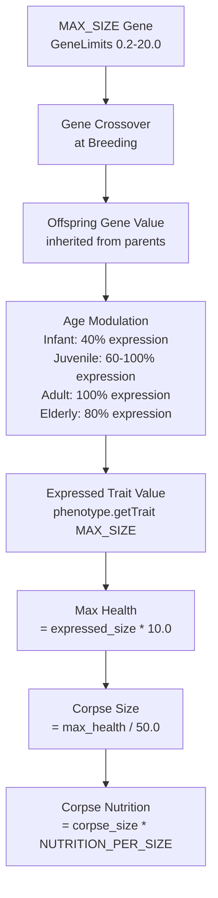

# Corpse Value Calculation Chain

This document describes the complete calculation chain from gene values to corpse nutrition, explaining the complexity behind the baby cannibalism exploit and why simple parameter changes are not straightforward.

## Overview

The corpse value of a creature is determined by a chain of calculations involving genetics, phenotype expression, health calculations, and finally nutrition constants. Understanding this chain is essential for addressing balance issues like the baby cannibalism exploit.

## Calculation Chain



## Detailed Breakdown

### 1. Gene Definition

**File:** [`UniversalGenes.cpp:210-212`](../../../src/genetics/defaults/UniversalGenes.cpp:210)

```cpp
// [0.2, 20.0], creep 0.2 - lowered from 0.5 to help prevent baby cannibalism exploit
GeneDefinition maxSize(MAX_SIZE, ChromosomeType::Morphology,
    GeneLimits(0.2f, 20.0f, 0.2f), DominanceType::Incomplete);
```

- **Minimum gene value:** 0.2 (lowered from 0.5 to help prevent baby cannibalism exploit)
- **Maximum gene value:** 20.0
- **Creep rate:** 0.2 (mutation step)
- **Dominance:** Incomplete (offspring gets average of parents)

### 2. Breeding and Gene Crossover

**File:** [`creature.cpp:1299-1318`](../../../src/objects/creature/creature.cpp:1299)

When creatures breed:
- Both parents' genomes are crossed using `Genome::crossover()`
- For incomplete dominance genes like MAX_SIZE, offspring typically inherits values similar to parents
- No special "offspring size" gene exists - offspring use their MAX_SIZE gene directly

### 3. Age Modulation (Phenotype Expression)

**File:** [`Phenotype.cpp:311-354`](../../../src/genetics/expression/Phenotype.cpp:311)

The game uses a 4-stage development system to modulate trait expression based on age:

```cpp
float Phenotype::applyAgeModulation(float value, float age_normalized) const {
    float age = std::clamp(age_normalized, 0.0f, 1.0f);
    float modulation_factor = 1.0f;

    if (age < 0.05f) {
        // Infant phase: 40% expression at birth, linearly increasing to 60% at age 0.05
        // This significantly reduces newborn corpse value to prevent baby cannibalism exploit
        modulation_factor = 0.4f + (age / 0.05f) * 0.2f;
    }
    else if (age < 0.15f) {
        // Juvenile phase: 60% expression → 100% at age 0.15
        modulation_factor = 0.6f + ((age - 0.05f) / 0.1f) * 0.4f;
    }
    else if (age < 0.8f) {
        // Adult phase: 100% expression
        modulation_factor = 1.0f;
    }
    else {
        // Elderly phase: 100% → 80% at age 1.0
        modulation_factor = 1.0f - ((age - 0.8f) / 0.2f * 0.2f);
    }
    
    return value * modulation_factor;
}
```

**Development Stages:**

| Stage | Age Range | Expression | Purpose |
|-------|-----------|------------|---------|
| Infant | 0.0 - 0.05 | 40% → 60% | Reduces newborn corpse value to prevent baby cannibalism exploit |
| Juvenile | 0.05 - 0.15 | 60% → 100% | Growth phase to full size |
| Adult | 0.15 - 0.80 | 100% | Peak expression |
| Elderly | 0.80 - 1.00 | 100% → 80% | Gradual decline with age |

**Key insight:** Newborn creatures (age_normalized ≈ 0) have their traits expressed at **40%** of their genetic potential (reduced from 60% to help prevent the baby cannibalism exploit).

### 4. Max Health Calculation

**File:** [`creature.cpp:2112-2115`](../../../src/objects/creature/creature.cpp:2112)

```cpp
float Creature::getMaxHealth() const {
    if (_phenotype && _phenotype->hasTrait(EcoSim::Genetics::UniversalGenes::MAX_SIZE)) {
        return _phenotype->getTrait(EcoSim::Genetics::UniversalGenes::MAX_SIZE) * 10.0f;
    }
    // fallback
}
```

**Formula:** `MaxHealth = expressed_MAX_SIZE × 10.0`

> [!IMPORTANT]
> This uses `getTrait()` which applies age modulation, NOT raw gene values.

### 5. Corpse Size Calculation

**File:** [`main.cpp:290`](../../../src/main.cpp:290)

```cpp
float creatureSize = activeC->getMaxHealth() / 50.0f;  // 50 HP per size unit
```

**Formula:** `CorpseSize = MaxHealth / 50.0`

### 6. Corpse Nutrition Calculation

**File:** [`Corpse.hpp:11`](../../../include/world/Corpse.hpp:11)

```cpp
static constexpr float NUTRITION_PER_SIZE = 50.0f;  // reduced from 100 to fix cannibalism exploit
```

**Formula:** `CorpseNutrition = CorpseSize × NUTRITION_PER_SIZE`

## Complete Formula Chain

Combining all steps for a **newborn creature** (with infant 40% expression):

```
CorpseNutrition = (MAX_SIZE_gene × 0.4 × 10.0 / 50.0) × NUTRITION_PER_SIZE
                = MAX_SIZE_gene × 0.08 × NUTRITION_PER_SIZE
```

Simplified:
```
CorpseNutrition = MAX_SIZE_gene × 0.08 × NUTRITION_PER_SIZE
```

> [!NOTE]
> The multiplier changed from 0.12 (with 60% juvenile expression) to 0.08 (with 40% infant expression), making the exploit threshold 50% higher.

## Example Calculations

### Example 1: Pack Hunter Newborn

| Archetype | MAX_SIZE Gene Range |
|-----------|-------------------|
| Pack Hunter | 1.0 - 1.4 |

Using typical value of 1.2:

| Step | Calculation | Value |
|------|-------------|-------|
| Gene Value | Given | 1.2 |
| Age Modulation (infant 40%) | 1.2 × 0.4 | 0.48 |
| Max Health | 0.48 × 10.0 | 4.8 |
| Corpse Size | 4.8 / 50.0 | 0.096 |
| Nutrition (NPS=50) | 0.096 × 50 | **4.8 cal** |

**Breeding ROI:** 4.8 / 6.0 = **0.8x** (safe - costs more than it yields!)

### Example 2: Apex Predator Newborn

| Archetype | MAX_SIZE Gene Range |
|-----------|-------------------|
| Apex Predator | 2.3 - 2.7 |

Using typical value of 2.5:

| Step | Calculation | Value |
|------|-------------|-------|
| Gene Value | Given | 2.5 |
| Age Modulation (infant 40%) | 2.5 × 0.4 | 1.0 |
| Max Health | 1.0 × 10.0 | 10.0 |
| Corpse Size | 10.0 / 50.0 | 0.2 |
| Nutrition (NPS=50) | 0.2 × 50 | **10.0 cal** |

**Breeding ROI:** 10.0 / 6.0 = **1.67x** (still exploitable, but reduced from 2.5x!)

### Example 3: Fleet Runner Newborn (smallest predator/herbivore)

| Archetype | MAX_SIZE Gene Range |
|-----------|-------------------|
| Fleet Runner | 0.8 - 1.2 |

Using minimum value of 0.8:

| Step | Calculation | Value |
|------|-------------|-------|
| Gene Value | Given | 0.8 |
| Age Modulation (infant 40%) | 0.8 × 0.4 | 0.32 |
| Max Health | 0.32 × 10.0 | 3.2 |
| Corpse Size | 3.2 / 50.0 | 0.064 |
| Nutrition (NPS=50) | 0.064 × 50 | **3.2 cal** |

**Breeding ROI:** 3.2 / 6.0 = **0.53x** (very safe - significant loss!)

### Example 4: Minimum Possible Size Newborn

| Archetype | MAX_SIZE Gene Value |
|-----------|-------------------|
| Minimum Gene | 0.2 |

Using the new gene minimum of 0.2:

| Step | Calculation | Value |
|------|-------------|-------|
| Gene Value | Given | 0.2 |
| Age Modulation (infant 40%) | 0.2 × 0.4 | 0.08 |
| Max Health | 0.08 × 10.0 | 0.8 |
| Corpse Size | 0.8 / 50.0 | 0.016 |
| Nutrition (NPS=50) | 0.016 × 50 | **0.8 cal** |

**Breeding ROI:** 0.8 / 6.0 = **0.13x** (exploit completely eliminated!)

## Breeding Constants

**File:** [`creature.hpp`](../../../include/objects/creature/creature.hpp)

```cpp
static const float BREED_COST;  // = 3.0 calories per parent
```

**Total breeding cost:** 2 parents × 3.0 = **6.0 calories**

## Exploit Threshold Analysis

For an exploit to exist: `CorpseNutrition > TotalBreedCost`

With the new 40% infant expression:
```
MAX_SIZE_gene × 0.08 × NUTRITION_PER_SIZE > 6.0
MAX_SIZE_gene > 6.0 / (0.08 × NUTRITION_PER_SIZE)
MAX_SIZE_gene > 75 / NUTRITION_PER_SIZE
```

| NUTRITION_PER_SIZE | Minimum Exploitable MAX_SIZE (40% infant) | Old Threshold (60% juvenile) |
|-------------------|------------------------------------------|-----------------------------|
| 100 (original) | 0.75 | 0.5 |
| 50 (current) | **1.5** | 1.0 |
| 25 | 3.0 | 2.0 |
| 20 | 3.75 | 2.5 |

> [!NOTE]
> The infant stage (40% expression) raised the exploit threshold from MAX_SIZE > 1.0 to MAX_SIZE > 1.5, protecting most medium-sized archetypes.

## Archetype Vulnerability Analysis (Updated for 40% Infant Expression)

| Archetype | MAX_SIZE Range | Exploitable at NPS=50? | ROI at Birth |
|-----------|----------------|------------------------|--------------|
| Fleet Runner | 0.8-1.2 | ✗ | 0.53-0.8x |
| Pack Hunter | 1.0-1.4 | ✗ | 0.67-0.93x |
| Pursuit Hunter | 1.3-1.7 | ✗ to ✓ (barely) | 0.87-1.13x |
| Canopy Forager | 1.0-1.6 | ✗ to ✓ (barely) | 0.67-1.07x |
| Spiky Defender | 1.1-1.5 | ✗ | 0.73-1.0x |
| Carrion Stalker | 1.6-2.0 | ✓ (barely) | 1.07-1.33x |
| Ambush Predator | 2.0-2.4 | ✓ | 1.33-1.6x |
| Armored Grazer | 2.3-2.7 | ✓ | 1.53-1.8x |
| Apex Predator | 2.3-2.7 | ✓ | 1.53-1.8x |
| Tank Herbivore | 2.8-3.2 | ✓ | 1.87-2.13x |

> [!TIP]
> With infant 40% expression + NPS=50, only archetypes with MAX_SIZE > 1.5 remain exploitable. This protects **6 out of 10 archetypes** compared to **only 1** with the old 60% juvenile expression.

## Fix Options Analysis

### Option 1: Lower NUTRITION_PER_SIZE

**Target:** NPS ≤ 20 to prevent exploit for most archetypes

**Pros:**
- Simple single-value change
- Affects all corpses uniformly

**Cons:**
- Very drastic reduction (100 → 20 = 80% reduction)
- May make hunting less worthwhile (trophic efficiency concerns)
- Adult corpses also become much less valuable

### Option 2: Increase BREED_COST

**Target:** BREED_COST ≥ 12.5 per parent (25 total)

To make apex predator newborn (15 cal corpse) unprofitable: need breed cost > 15

**Pros:**
- Directly targets the exploit

**Cons:**
- May make breeding too expensive for survival
- Parent viability constraints (can't spend more than ~5.9 per parent without risking starvation)

### Option 3: Add Cannibalism Penalty

Implement 50-70% nutrition reduction when eating own offspring.

**Pros:**
- Targeted fix that doesn't affect normal gameplay
- Biologically realistic (kin recognition)

**Cons:**
- Requires code changes to track offspring relationships
- More complex implementation

### Option 4: Offspring-Specific Nutrition Scaling

Add an age multiplier to corpse nutrition calculation.

```cpp
float ageMultiplier = std::min(1.0f, creature->getAgeNormalized() * 5.0f);  // 0% at birth → 100% at 20% lifespan
float nutrition = corpseSize * NUTRITION_PER_SIZE * ageMultiplier;
```

**Pros:**
- Naturally prevents baby cannibalism
- Adult corpses retain full value
- Biologically realistic (babies have less meat)

**Cons:**
- Requires modifying corpse creation code
- May need to track creature age at death

### Option 5: Hybrid Approach

Combine multiple smaller changes:
1. Lower NUTRITION_PER_SIZE to 35-40 (not as drastic)
2. Add age scaling to corpse value (40% at birth → 100% at maturity)
3. Small breed cost increase (3 → 4 per parent)

## LP Solver Context

The LP optimizer in the balance diagnostic tool models these constraints linearly. However, the actual calculation involves:

1. **Gene crossover** - probabilistic
2. **Age modulation** - nonlinear (40% infant → 60% juvenile → 100% adult → 80% elderly)
3. **Multiple conversion factors** (10.0, 50.0)

The LP uses **MIN_OFFSPRING_SIZE** as a simplified constant to represent the "effective size" of newborn corpses, which is why the analysis tool and actual game may show different results.

### LP Simplification

The LP models:
```
CorpseNutrition = MIN_OFFSPRING_SIZE × NUTRITION_PER_SIZE
```

Where `MIN_OFFSPRING_SIZE` is calculated from game constants:
```cpp
MIN_OFFSPRING_SIZE = MIN_GENE_SIZE × INFANT_EXPRESSION × HEALTH_PER_SIZE / CORPSE_DIVISOR
                   = 0.2 × 0.4 × 10.0 / 50.0
                   = 0.016
```

This represents the absolute minimum newborn corpse size (a creature with the minimum gene value of 0.2).

### Current LP Configuration

With the infant stage implementation:
```
actual_corpse_size = MAX_SIZE_gene × 0.4 × 10.0 / 50.0 = MAX_SIZE_gene × 0.08
```

**For `MIN_OFFSPRING_SIZE = 0.016`:**
- Corpse nutrition = 0.016 × 50 = **0.8 calories**
- Breeding ROI = 0.8 / 6.0 = **13.3%** (exploit completely eliminated!)

## Current Status: Exploit Mitigation

The baby cannibalism exploit has been significantly mitigated through two changes:

### Changes Implemented

1. **Lowered MAX_SIZE gene minimum:** 0.5 → 0.2
   - Allows evolution of smaller creatures
   - Provides lower bound for offspring size

2. **Added infant development stage:** 40% expression at birth (down from 60%)
   - Reduces newborn corpse value by 33%
   - Raises exploit threshold from MAX_SIZE > 1.0 to MAX_SIZE > 1.5

### Remaining Vulnerability

Only the largest archetypes (MAX_SIZE > 1.5) remain exploitable:
- Carrion Stalker: 1.6-2.0 (barely)
- Ambush Predator: 2.0-2.4
- Armored Grazer: 2.3-2.7
- Apex Predator: 2.3-2.7
- Tank Herbivore: 2.8-3.2

### Recommendations for Further Mitigation

1. **Additional Option: Lower NUTRITION_PER_SIZE to 35**
   - Would raise threshold to MAX_SIZE > 2.14
   - Protects Carrion Stalker and most of Ambush Predator

2. **Additional Option: Age-scaled corpse nutrition**
   - 30% nutrition at birth → 100% at maturity
   - Completely eliminates exploit for all archetypes
   - Most targeted fix

3. **Long-term: Kin recognition system**
   - Nutrition penalties for cannibalism of related creatures
   - Most biologically realistic solution

## See Also

- [[breeding-roi-constraint]] - LP optimizer breeding constraints
- [[trophic-efficiency]] - Energy flow and hunting worthiness
- [[phenotype-expression]] - Age modulation system
- [`BalanceOptimizer.cpp`](../../../src/testing/balance/BalanceOptimizer.cpp) - LP optimization code
- [`ExploitDetector.cpp`](../../../src/testing/balance/ExploitDetector.cpp) - Exploit detection
- [`Phenotype.cpp`](../../../src/genetics/expression/Phenotype.cpp) - Age modulation implementation
- [`UniversalGenes.cpp`](../../../src/genetics/defaults/UniversalGenes.cpp) - Gene definitions

