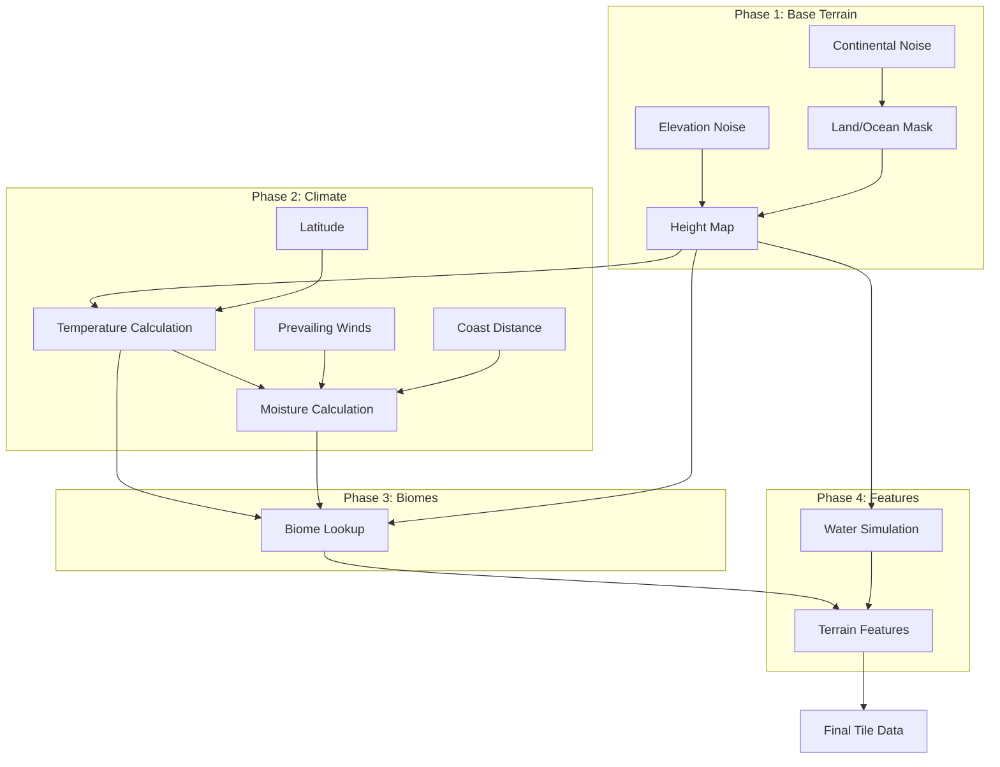

# World Generation System Design

## Overview

This document describes a comprehensive world generation system that replaces the current elevation-only approach with a climate-based biome system. The new system generates believable, geographically coherent worlds where terrain, climate, and biomes interact realistically.

## Current System Analysis

### Problems with Elevation-Only Approach

The current [`WorldGenerator.cpp`](../../../src/world/WorldGenerator.cpp) uses a simple elevation threshold system:

```cpp
// Current: Terrain assigned purely by elevation bands
_tileGen.push_back(TileGenRule{90,  ..., DEEP_WATER});    // 0-90
_tileGen.push_back(TileGenRule{135, ..., SAND});          // 120-135
_tileGen.push_back(TileGenRule{138, ..., DESERT_SAND});   // 135-138
_tileGen.push_back(TileGenRule{155, ..., PLAINS});        // 138-155
// ... elevation bands continue
```

**Issues:**

| Problem | Impact |
|---------|--------|
| **Desert at specific elevation** | Deserts should be where it's hot and dry, not at elevation 135-138 |
| **No latitude effects** | Equator and poles are identical |
| **No moisture variation** | Rain forests and deserts can't coexist at same elevation |
| **Rivers are impossible** | Water is just "low elevation" |
| **Sand below desert** | Geographic nonsense - sand is a feature, not a lower biome |
| **17 hardcoded types** | Mix of terrain features and biomes |

### What We Want

A world where:
- **Hot regions** have deserts (when dry) or rainforests (when wet)
- **Cold regions** have tundra (when dry) or taiga (when wet)
- **Rivers** flow from mountains to sea following terrain
- **Rain shadows** create dry areas behind mountains
- **Coastlines** have appropriate beach/marsh transitions
- **Elevation** affects temperature, not biome directly

---

## New Architecture

### Generation Pipeline



### Core Data Structures

```cpp
// Biome types - based on climate, not elevation
enum class Biome {
    // Aquatic
    OCEAN_DEEP,
    OCEAN_SHALLOW,
    OCEAN_COAST,
    FRESHWATER,
    
    // Cold biomes
    ICE_SHEET,
    TUNDRA,
    TAIGA,
    
    // Temperate biomes
    BOREAL_FOREST,
    TEMPERATE_RAINFOREST,
    TEMPERATE_FOREST,
    TEMPERATE_GRASSLAND,
    
    // Warm biomes  
    TROPICAL_RAINFOREST,
    TROPICAL_SEASONAL_FOREST,
    SAVANNA,
    
    // Dry biomes
    DESERT_HOT,
    DESERT_COLD,
    STEPPE,
    SHRUBLAND,
    
    // Elevation-dependent
    ALPINE_MEADOW,
    ALPINE_TUNDRA,
    MOUNTAIN_BARE,
    GLACIER
};

// Terrain features - physical characteristics
enum class TerrainFeature {
    FLAT,
    ROLLING,
    HILLS,
    MOUNTAINS,
    CLIFF,
    VALLEY,
    CANYON,
    
    // Water features
    RIVER,
    LAKE,
    MARSH,
    BEACH,
    REEF
};

// Complete tile climate data
struct TileClimate {
    float elevation;        // 0.0 - 1.0 normalized
    float temperature;      // Celsius (-40 to +50)
    float moisture;         // 0.0 - 1.0 (precipitation index)
    float waterLevel;       // For dynamic water simulation
    
    Biome biome;
    TerrainFeature feature;
    
    // Derived properties
    bool isLand() const;
    bool hasWater() const;
    float getAnnualRainfall() const;
};
```

---

## Phase 1: Base Terrain Generation

### Continental Shape

Generate large-scale land masses using low-frequency noise:

```cpp
float WorldGenerator::generateContinentNoise(int x, int y) {
    // Very low frequency for continent-scale features
    float continentFreq = 0.002f;
    
    float noise = SimplexNoise::noise(
        x * continentFreq + _seed,
        y * continentFreq + _seed
    );
    
    // Add octaves for coastline detail
    noise += 0.5f * SimplexNoise::noise(
        x * continentFreq * 2 + _seed,
        y * continentFreq * 2 + _seed
    );
    noise += 0.25f * SimplexNoise::noise(
        x * continentFreq * 4 + _seed,
        y * continentFreq * 4 + _seed
    );
    
    noise /= 1.75f;  // Normalize
    
    // Optional: Island mode - reduce near edges
    if (_config.isIsland) {
        float edgeDist = distanceToEdge(x, y);
        noise *= smoothstep(0.0f, 0.3f, edgeDist);
    }
    
    return noise;
}
```

### Elevation Detail

Add mountain ranges and terrain detail:

```cpp
float WorldGenerator::generateElevation(int x, int y, float continent) {
    // Only generate detail on land
    if (continent < _config.seaLevel) {
        // Ocean floor - gentle variation
        return continent * 0.3f;
    }
    
    // Land elevation with multiple octaves
    float elevation = continent;
    
    // Mountain ridges using ridged noise
    float ridgeFreq = 0.01f;
    float ridge = ridgedNoise(x * ridgeFreq, y * ridgeFreq);
    
    // Mountains form along ridges
    elevation += ridge * 0.4f * (continent - _config.seaLevel);
    
    // Local terrain variation
    float detailFreq = 0.05f;
    float detail = SimplexNoise::noise(x * detailFreq, y * detailFreq);
    elevation += detail * 0.1f;
    
    return std::clamp(elevation, 0.0f, 1.0f);
}

// Ridged noise for mountain ranges
float WorldGenerator::ridgedNoise(float x, float y) {
    float noise = SimplexNoise::noise(x, y);
    noise = 1.0f - std::abs(noise);  // Invert absolute value
    noise = noise * noise;            // Square for sharper ridges
    return noise;
}
```

---

## Phase 2: Climate Calculation

### Temperature

Temperature depends on:
1. **Latitude** - Equator hot, poles cold
2. **Elevation** - Higher = colder (lapse rate)
3. **Local variation** - Climate noise

```cpp
float WorldGenerator::calculateTemperature(int x, int y, float elevation) {
    // 1. Base temperature from latitude
    // Assume y=0 is south pole, y=height is north pole
    float latitude = static_cast<float>(y) / _config.height;
    float latitudeFactor = std::cos((latitude - 0.5f) * M_PI);
    
    // Equator: 30°C base, Poles: -20°C base
    float baseTemp = -20.0f + 50.0f * (latitudeFactor + 1.0f) / 2.0f;
    
    // 2. Elevation cooling (lapse rate: -6.5°C per 1000m)
    // Assume max elevation = 8000m
    float elevationMeters = elevation * 8000.0f;
    float elevationCooling = -0.0065f * elevationMeters;
    
    // 3. Local climate variation
    float tempNoise = SimplexNoise::noise(
        x * 0.01f + _seed * 2,
        y * 0.01f + _seed * 2
    ) * 5.0f;  // ±5°C variation
    
    return baseTemp + elevationCooling + tempNoise;
}
```

### Moisture

Moisture depends on:
1. **Distance from water** - Closer = wetter
2. **Prevailing winds** - Wind direction matters
3. **Rain shadow** - Mountains block moisture
4. **Temperature** - Hot air holds more moisture

```cpp
float WorldGenerator::calculateMoisture(int x, int y, float elevation, float temperature) {
    // 1. Base moisture from distance to water
    float coastDist = distanceToWater(x, y);
    float baseMoisture = std::exp(-coastDist / 50.0f);  // Exponential decay
    
    // 2. Prevailing wind effect
    // Assume westerly winds (from left side of map)
    float windMoisture = calculateWindMoisture(x, y);
    
    // 3. Rain shadow - check for mountains upwind
    float rainShadow = calculateRainShadow(x, y);
    
    // 4. Temperature effect - hot regions can be wetter
    float tempFactor = 1.0f + 0.02f * std::max(0.0f, temperature);
    
    // 5. Local variation
    float moistNoise = SimplexNoise::noise(
        x * 0.008f + _seed * 3,
        y * 0.008f + _seed * 3
    ) * 0.3f;
    
    float moisture = baseMoisture * windMoisture * rainShadow * tempFactor + moistNoise;
    return std::clamp(moisture, 0.0f, 1.0f);
}

float WorldGenerator::calculateRainShadow(int x, int y) {
    // Check elevation upwind (west)
    float shadow = 1.0f;
    float maxUpwindElevation = 0.0f;
    
    // Look 100 tiles upwind
    for (int dx = 1; dx < 100 && x - dx >= 0; dx++) {
        float upwindElev = getElevation(x - dx, y);
        if (upwindElev > maxUpwindElevation) {
            maxUpwindElevation = upwindElev;
        }
    }
    
    float currentElev = getElevation(x, y);
    if (maxUpwindElevation > currentElev + 0.1f) {
        // In rain shadow - reduce moisture
        shadow = 0.3f + 0.7f * (currentElev / maxUpwindElevation);
    }
    
    return shadow;
}
```

---

## Phase 3: Biome Determination

### Whittaker Diagram Implementation

Biomes are determined by temperature and moisture using a lookup table:

```cpp
// Biome lookup table (simplified Whittaker diagram)
// Rows: Temperature (cold to hot)
// Columns: Moisture (dry to wet)

static const Biome BIOME_TABLE[6][5] = {
    // Temperature zones: FROZEN, COLD, COOL, WARM, HOT
    // Moisture:          ARID    DRY     MODERATE  WET      SATURATED
    
    // FROZEN (-20 to -10°C)
    {Biome::ICE_SHEET, Biome::ICE_SHEET, Biome::TUNDRA, Biome::TUNDRA, Biome::GLACIER},
    
    // COLD (-10 to 0°C)
    {Biome::DESERT_COLD, Biome::TUNDRA, Biome::TAIGA, Biome::TAIGA, Biome::BOREAL_FOREST},
    
    // COOL (0 to 10°C)
    {Biome::STEPPE, Biome::SHRUBLAND, Biome::TEMPERATE_FOREST, Biome::TEMPERATE_FOREST, Biome::TEMPERATE_RAINFOREST},
    
    // TEMPERATE (10 to 20°C)
    {Biome::STEPPE, Biome::TEMPERATE_GRASSLAND, Biome::TEMPERATE_FOREST, Biome::TEMPERATE_FOREST, Biome::TEMPERATE_RAINFOREST},
    
    // WARM (20 to 30°C)
    {Biome::DESERT_HOT, Biome::SAVANNA, Biome::SAVANNA, Biome::TROPICAL_SEASONAL_FOREST, Biome::TROPICAL_RAINFOREST},
    
    // HOT (30°C+)
    {Biome::DESERT_HOT, Biome::DESERT_HOT, Biome::SAVANNA, Biome::TROPICAL_SEASONAL_FOREST, Biome::TROPICAL_RAINFOREST}
};

Biome WorldGenerator::getBiome(float temperature, float moisture, float elevation) {
    // Special cases for water and high elevation
    if (elevation < _config.seaLevel) {
        float depth = _config.seaLevel - elevation;
        if (depth > 0.2f) return Biome::OCEAN_DEEP;
        if (depth > 0.1f) return Biome::OCEAN_SHALLOW;
        return Biome::OCEAN_COAST;
    }
    
    // High elevation overrides
    if (elevation > 0.85f) {
        if (temperature < -10) return Biome::GLACIER;
        if (temperature < 0) return Biome::ALPINE_TUNDRA;
        return Biome::MOUNTAIN_BARE;
    }
    if (elevation > 0.7f && temperature < 10) {
        return Biome::ALPINE_MEADOW;
    }
    
    // Temperature zone (0-5)
    int tempZone = 0;
    if (temperature > 30) tempZone = 5;
    else if (temperature > 20) tempZone = 4;
    else if (temperature > 10) tempZone = 3;
    else if (temperature > 0) tempZone = 2;
    else if (temperature > -10) tempZone = 1;
    
    // Moisture zone (0-4)
    int moistZone = static_cast<int>(moisture * 4.99f);
    moistZone = std::clamp(moistZone, 0, 4);
    
    return BIOME_TABLE[tempZone][moistZone];
}
```

### Biome Properties

Each biome has associated properties for simulation:

```cpp
struct BiomeProperties {
    const char* name;
    float baseTemperatureModifier;  // Local temp adjustment
    float evaporationRate;          // Water loss
    float vegetationDensity;        // Plant spawning
    float movementCost;             // Creature movement
    bool supportsPlants;
    bool supportsTrees;
    
    // Visual
    TerrainType terrainType;        // For rendering
    char displayChar;
};

static const std::map<Biome, BiomeProperties> BIOME_PROPERTIES = {
    {Biome::TROPICAL_RAINFOREST, {
        "Tropical Rainforest", 2.0f, 0.3f, 1.0f, 1.5f, true, true,
        TerrainType::FOREST, '"'
    }},
    {Biome::DESERT_HOT, {
        "Hot Desert", 5.0f, 2.0f, 0.05f, 1.2f, false, false,
        TerrainType::DESERT_SAND, '.'
    }},
    {Biome::TUNDRA, {
        "Tundra", -5.0f, 0.5f, 0.2f, 1.3f, true, false,
        TerrainType::SNOW, ','
    }},
    // ... etc
};
```

---

## Phase 4: Water Systems

### River Generation

Rivers flow from high elevation to low, following terrain:

```cpp
void WorldGenerator::generateRivers() {
    std::vector<RiverSource> sources;
    
    // Find river sources in mountains
    for (int y = 0; y < _config.height; y++) {
        for (int x = 0; x < _config.width; x++) {
            float elev = getElevation(x, y);
            float moist = getMoisture(x, y);
            
            // High elevation + high moisture = river source
            if (elev > 0.7f && moist > 0.6f) {
                // Random chance to start river
                if (randomFloat() < 0.01f) {
                    sources.push_back({x, y, moist * 10.0f});
                }
            }
        }
    }
    
    // Trace each river downhill
    for (auto& source : sources) {
        traceRiver(source.x, source.y, source.flow);
    }
}

void WorldGenerator::traceRiver(int x, int y, float flow) {
    while (flow > 0.1f) {
        // Mark current tile as river
        getTile(x, y).feature = TerrainFeature::RIVER;
        getTile(x, y).waterLevel = flow * 0.1f;
        
        // Find lowest neighbor
        int nextX = x, nextY = y;
        float lowestElev = getElevation(x, y);
        
        for (auto [dx, dy] : NEIGHBORS_8) {
            int nx = x + dx, ny = y + dy;
            if (!inBounds(nx, ny)) continue;
            
            float neighborElev = getElevation(nx, ny);
            if (neighborElev < lowestElev) {
                lowestElev = neighborElev;
                nextX = nx;
                nextY = ny;
            }
        }
        
        // Check if we reached water or got stuck
        if (nextX == x && nextY == y) {
            // Local minimum - create lake
            floodFillLake(x, y, flow);
            return;
        }
        
        if (lowestElev < _config.seaLevel) {
            // Reached ocean
            return;
        }
        
        // Accumulate tributaries
        flow += getMoisture(nextX, nextY) * 0.5f;
        
        x = nextX;
        y = nextY;
    }
}
```

### Lake Formation

Lakes form in terrain depressions:

```cpp
void WorldGenerator::floodFillLake(int startX, int startY, float inflow) {
    float waterLevel = getElevation(startX, startY);
    std::queue<std::pair<int,int>> frontier;
    std::set<std::pair<int,int>> lake;
    
    frontier.push({startX, startY});
    lake.insert({startX, startY});
    
    while (!frontier.empty()) {
        auto [x, y] = frontier.front();
        frontier.pop();
        
        for (auto [dx, dy] : NEIGHBORS_8) {
            int nx = x + dx, ny = y + dy;
            if (!inBounds(nx, ny)) continue;
            if (lake.count({nx, ny})) continue;
            
            float neighborElev = getElevation(nx, ny);
            
            if (neighborElev <= waterLevel) {
                // Below water level - part of lake
                lake.insert({nx, ny});
                frontier.push({nx, ny});
            } else if (neighborElev < waterLevel + 0.05f) {
                // Potential outlet - continue river
                for (auto& [lx, ly] : lake) {
                    getTile(lx, ly).feature = TerrainFeature::LAKE;
                    getTile(lx, ly).waterLevel = waterLevel - getElevation(lx, ly);
                }
                traceRiver(nx, ny, inflow * 0.8f);
                return;
            }
        }
    }
    
    // Enclosed lake - mark tiles
    for (auto& [lx, ly] : lake) {
        getTile(lx, ly).feature = TerrainFeature::LAKE;
        getTile(lx, ly).waterLevel = waterLevel - getElevation(lx, ly);
        getTile(lx, ly).biome = Biome::FRESHWATER;
    }
}
```

---

## Implementation Plan

### Step 1: Data Structure Updates

```cpp
// Update Tile class
class Tile {
    // Replace current simple fields with:
    TileClimate _climate;
    
    // Keep for rendering compatibility:
    TerrainType getTerrainType() const {
        return biomeToTerrainType(_climate.biome);
    }
};
```

### Step 2: New Generator Class

```cpp
class ClimateWorldGenerator {
public:
    void generate(WorldGrid& grid, const GeneratorConfig& config);
    
private:
    // Generation phases
    void generateContinent();
    void generateElevation();
    void calculateClimate();
    void determineBiomes();
    void generateWaterFeatures();
    void applyFeatures();
    
    // Noise helpers
    float continentNoise(int x, int y);
    float elevationNoise(int x, int y);
    float ridgedNoise(float x, float y);
    
    // Climate helpers
    float calculateTemperature(int x, int y);
    float calculateMoisture(int x, int y);
    float calculateRainShadow(int x, int y);
    
    // Biome helpers
    Biome lookupBiome(float temp, float moisture, float elevation);
    
    // Water helpers
    void traceRiver(int x, int y, float flow);
    void floodFillLake(int x, int y, float level);
    
    // Intermediate data
    std::vector<std::vector<float>> _continentMap;
    std::vector<std::vector<float>> _elevationMap;
    std::vector<std::vector<float>> _temperatureMap;
    std::vector<std::vector<float>> _moistureMap;
    
    GeneratorConfig _config;
    float _seed;
};
```

### Step 3: Configuration

```cpp
struct GeneratorConfig {
    // Dimensions
    unsigned int width = 500;
    unsigned int height = 500;
    
    // Terrain
    float seaLevel = 0.4f;
    bool isIsland = true;
    
    // Climate
    float equatorLatitude = 0.5f;    // Where is equator (0-1)
    float temperatureRange = 70.0f;  // Pole-to-equator range
    float moistureScale = 1.0f;
    
    // Features
    bool generateRivers = true;
    int maxRivers = 20;
    bool generateLakes = true;
    
    // Noise
    float continentFrequency = 0.002f;
    float elevationFrequency = 0.01f;
    int elevationOctaves = 4;
    
    // Seed
    unsigned int seed = 0;
};
```

### Migration Strategy

1. **Create new generator alongside existing** - Don't break current functionality
2. **Add feature flag** - `useClimateGeneration` in config
3. **Map new biomes to old TerrainTypes** - Backward compatibility for rendering
4. **Gradually migrate rendering** - New biome-aware rendering system
5. **Remove old generator** - Once new one is stable

---

## Biome Properties for Simulation

### Environmental Effects

| Biome | Temperature Mod | Moisture Mod | Light Mod | Movement Cost |
|-------|-----------------|--------------|-----------|---------------|
| Tropical Rainforest | +2°C | +0.3 | 0.4 (shade) | 1.5x |
| Desert Hot | +8°C | -0.5 | 1.0 | 1.2x |
| Desert Cold | -5°C | -0.4 | 1.0 | 1.2x |
| Taiga | -3°C | +0.1 | 0.7 | 1.3x |
| Tundra | -8°C | 0.0 | 0.9 | 1.4x |
| Temperate Forest | 0°C | +0.1 | 0.5 | 1.2x |
| Grassland | +1°C | -0.1 | 1.0 | 1.0x |
| Savanna | +3°C | -0.2 | 0.9 | 1.0x |

### Flora Distribution

| Biome | Plant Density | Tree Density | Fruit Plants | Notes |
|-------|---------------|--------------|--------------|-------|
| Tropical Rainforest | 100% | 80% | High | Maximum biodiversity |
| Temperate Forest | 80% | 60% | Medium | Seasonal variation |
| Taiga | 50% | 70% | Low | Conifers dominate |
| Grassland | 70% | 5% | Low | Grasses, few trees |
| Desert | 10% | 0% | Very Low | Cacti, succulents |
| Tundra | 20% | 0% | Very Low | Mosses, lichens |

### Creature Adaptation

Creatures evolve genes to match their biome:

| Biome | Favored Genes | Penalized Genes |
|-------|---------------|-----------------|
| Desert | HEAT_TOLERANCE, FAT_STORAGE | FUR_DENSITY, SIZE |
| Tundra | COLD_TOLERANCE, FUR_DENSITY, FAT_STORAGE | HEAT_TOLERANCE |
| Forest | CAMOUFLAGE, CLIMBING | SIZE (for dense areas) |
| Grassland | SPEED, PERCEPTION | CAMOUFLAGE |
| Aquatic | AQUATIC_LOCOMOTION, GILL_EFFICIENCY | HEAT_TOLERANCE |

---

## Integration with Genesis (God Sim)

### Terraforming Effects

When player modifies terrain in Genesis, climate recalculates:

```cpp
void World::onTerrainModified(int x, int y, int radius) {
    // Recalculate affected area + buffer
    int buffer = 50;  // Climate effects extend beyond direct modification
    
    for (int dy = -radius - buffer; dy <= radius + buffer; dy++) {
        for (int dx = -radius - buffer; dx <= radius + buffer; dx++) {
            int tx = x + dx, ty = y + dy;
            if (!inBounds(tx, ty)) continue;
            
            // Recalculate temperature (elevation changed)
            recalculateTemperature(tx, ty);
            
            // Recalculate moisture (terrain blocks wind)
            recalculateMoisture(tx, ty);
            
            // Update biome
            updateBiome(tx, ty);
        }
    }
    
    // Regenerate rivers if elevation changed significantly
    if (elevationChangeSignificant) {
        regenerateRivers();
    }
}
```

### Climate Events

Genesis events interact with climate:

- **Drought** - Reduces moisture in area → biome shifts toward desert
- **Flood** - Increases moisture → swamp/marsh formation
- **Volcanic** - Creates mountains → rain shadow effects
- **Ice Age** - Global temperature drop → biome shifts toward tundra

---

## Performance Considerations

### Generation Time

| Phase | Complexity | Est. Time (500x500) |
|-------|------------|---------------------|
| Continental | O(n) | ~50ms |
| Elevation | O(n) | ~100ms |
| Temperature | O(n) | ~50ms |
| Moisture | O(n²) | ~500ms (rain shadow) |
| Biomes | O(n) | ~30ms |
| Rivers | O(r × l) | ~200ms |
| **Total** | | ~1 second |

### Runtime Updates

For dynamic climate (Phase A implementation):
- Cache climate calculations per tile
- Only recalculate when terrain changes
- Use spatial partitioning for rain shadow updates

---

## See Also

- [[world-roadmap]] - Environment systems roadmap (Phase A-F)
- [[../../future/environment/ecosystem-improvements]] - Ecosystem dynamics
- [[coevolution]] - Creature-plant adaptation
- [[../game-concepts/genesis-god-sim]] - Genesis game concept

---

**Last Updated:** 2026-01-08
