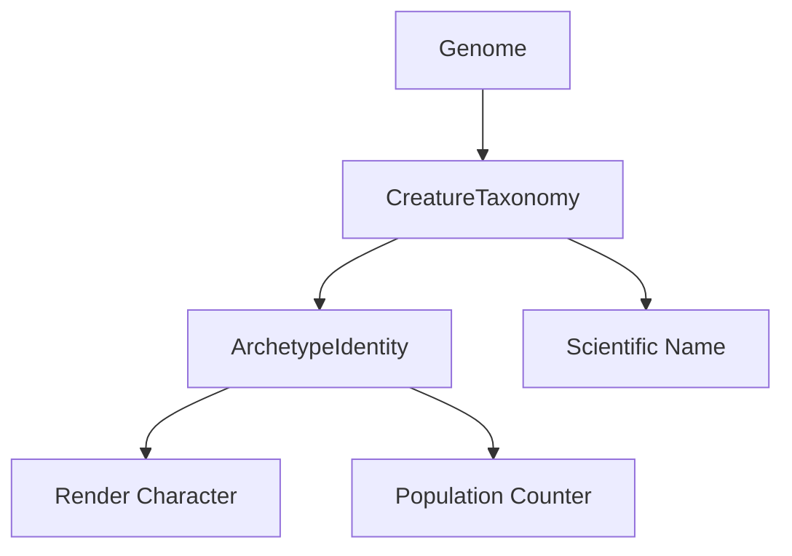

# Classification System

**Version:** 1.0
**Date:** 2025-12-25

The classification system provides automatic categorization of creatures based on their genetic makeup, including archetype assignment and scientific naming.

---

## Overview

The classification system consists of two main components:

1. **ArchetypeIdentity** - Flyweight pattern for shared archetype data
2. **CreatureTaxonomy** - Stateless classification and naming algorithms



---

## ArchetypeIdentity

A flyweight pattern implementation that provides shared identity objects for creature archetypes.

### Design Pattern

- **Flyweight Pattern**: Single instance per archetype type, shared across all creatures
- **Meyer's Singleton**: Thread-safe static initialization for each archetype
- **Immutable**: Identity properties cannot change after creation

### The 10 Archetypes

| Archetype | ID | Character | Description |
|-----------|-----|-----------|-------------|
| **Apex Predator** | `apex_predator` | `A` | Large, powerful, territorial dominant predator |
| **Pack Hunter** | `pack_hunter` | `P` | Small, fast, coordinated group hunters |
| **Ambush Predator** | `ambush_predator` | `I` | Patient, stealthy, high burst damage |
| **Pursuit Hunter** | `pursuit_hunter` | `V` | Fastest predator, speed-based chasers |
| **Tank Herbivore** | `tank_herbivore` | `T` | Large armored defensive herbivore with horn defense |
| **Armored Grazer** | `armored_grazer` | `K` | Scaled herbivore with tail club defense |
| **Fleet Runner** | `fleet_runner` | `R` | Speed-based escape specialist, minimal combat |
| **Spiky Defender** | `spiky_defender` | `S` | Counter-attack specialist with body spines |
| **Scavenger** | `scavenger` | `N` | Corpse-feeding specialist with high toxin tolerance |
| **Omnivore Generalist** | `omnivore_generalist` | `O` | Adaptable mixed diet, jack of all trades |

### Usage

```cpp
#include "genetics/classification/ArchetypeIdentity.hpp"

// Get archetype flyweight (never returns null)
const ArchetypeIdentity* apex = ArchetypeIdentity::ApexPredator();

// Access properties
std::string id = apex->getId();           // "apex_predator"
std::string label = apex->getLabel();     // "Apex Predator"
char renderChar = apex->getRenderChar();  // 'A'

// Population tracking (atomic, thread-safe)
apex->incrementPopulation();  // Called by Creature constructor
apex->decrementPopulation();  // Called by Creature destructor
int pop = apex->getPopulation();
```

### Thread Safety

- All static accessor methods are thread-safe
- Population counters use `std::atomic<int>`
- Returned pointers are never null and never become invalid

### Lifetime

- Flyweight objects live for the duration of the program
- Callers should NOT delete returned pointers
- Safe to store and use throughout application lifetime

---

## CreatureTaxonomy

A stateless utility class for classifying creatures and generating names.

### Classification Algorithm

The [`classifyArchetype()`](include/genetics/classification/CreatureTaxonomy.hpp:51) method uses RAW gene values (not age/health modulated) to determine archetype. This ensures classification remains stable throughout an organism's life.

**Classification Priority (checked in order):**

```cpp
// 1. Apex Predator
if (meatDig > 0.8 && size > 2.0 && aggression > 0.7)
    return ApexPredator();

// 2. Pack Hunter
if (meatDig > 0.7 && packCoord > 0.7 && size < 1.5)
    return PackHunter();

// 3. Ambush Predator
if (meatDig > 0.8 && scentMasking > 0.6 && locomotion < 0.8)
    return AmbushPredator();

// 4. Pursuit Hunter
if (meatDig > 0.7 && locomotion > 1.5)
    return PursuitHunter();

// 5. Scavenger
if (meatDig > 0.5 && huntInstinct < 0.3 && toxinTol > 0.7)
    return Scavenger();

// 6. Tank Herbivore
if (plantDig > 0.7 && hide > 0.7 && size > 2.0 && hornLen > 0.6)
    return TankHerbivore();

// 7. Armored Grazer
if (plantDig > 0.7 && scales > 0.7)
    return ArmoredGrazer();

// 8. Spiky Defender
if ((bodySpines > 0.5 || tailSpines > 0.5) && plantDig > 0.4)
    return SpikyDefender();

// 9. Fleet Runner
if (plantDig > 0.5 && locomotion > 1.5 && retreat > 0.7)
    return FleetRunner();

// 10. Default: Omnivore Generalist
return OmnivoreGeneralist();
```

### Scientific Naming Algorithm

The [`generateScientificName()`](include/genetics/classification/CreatureTaxonomy.hpp:75) method generates trinomial scientific names.

**Format:** `Genus species epithet`

**Example:** `Carnopredax titan dentatus`

#### Genus Generation

Genus = Diet Prefix + Behavior Suffix

**Diet Prefixes:**

| Condition | Prefix |
|-----------|--------|
| toxinTol > 0.7, huntInstinct < 0.3 | `Necro` |
| meatDig > 0.7 | `Carno` |
| plantDig > 0.7 | `Herbo` |
| default | `Omni` |

**Behavior Suffixes:**

| Condition | Suffix |
|-----------|--------|
| aggression > 0.8, size > 2.0 | `rex` |
| meatDig > 0.7, aggression > 0.6 | `predax` |
| scentMasking > 0.6 | `latens` |
| packCoord > 0.6 | `socialis` |
| locomotion > 1.5 | `cursor` |
| hide > 0.7 OR scales > 0.7 | `scutum` |
| bodySpines > 0.5 OR tailSpines > 0.5 | `insidia` |
| plantDig > 0.6, meatDig < 0.4 | `grazer` |
| default | `flexus` |

#### Species Generation

Based on size:

| Size Range | Species |
|------------|---------|
| < 0.7 | `minimus` |
| < 1.0 | `minor` |
| < 1.5 | `mediocris` |
| < 2.0 | `major` |
| < 2.5 | `grandis` |
| ≥ 2.5 | `titan` |

#### Epithet Generation

Most distinctive trait:

| Gene | Threshold | Epithet |
|------|-----------|---------|
| teeth_size | > 0.7 | `dentatus` |
| claw_length | > 0.7 | `unguiculatus` |
| horn_length | > 0.7 | `cornuatus` |
| tail_length | > 0.7 | `caudatus` |
| hide_thickness | > 0.7 | `fortis` |
| scale_coverage | > 0.7 | `squamatus` |
| fat_layer_thickness | > 0.7 | `crassus` |
| body_spines OR tail_spines | > 0.5 | `spinosus` |
| regeneration_rate | > 1.5 | `regenerans` |
| olfactory_acuity | > 0.7 | `olfactans` |
| sight_range | > 150 | `vigilans` |
| locomotion | > 1.5 | `velocis` |
| hide + scales + fat | > 1.5 | `armatus` |
| retreat_threshold | > 0.8 | `timidus` |
| default | - | `vulgaris` |

### Usage

```cpp
#include "genetics/classification/CreatureTaxonomy.hpp"

Genome genome = /* ... */;

// Get archetype
const ArchetypeIdentity* archetype = CreatureTaxonomy::classifyArchetype(genome);
std::cout << "Archetype: " << archetype->getLabel() << std::endl;

// Generate scientific name
std::string name = CreatureTaxonomy::generateScientificName(genome);
std::cout << "Species: " << name << std::endl;

// Get raw gene value (bypasses phenotype age modulation)
float meatDig = CreatureTaxonomy::getRawGeneValue(genome, "meat_digestion_efficiency");
```

---

## Integration with Creature

The classification system integrates with the Creature class:

```cpp
class Creature {
public:
    // Classification (set once at birth)
    const ArchetypeIdentity* getArchetype() const { return archetype_; }
    const std::string& getScientificName() const { return scientificName_; }
    
    // Render character from archetype
    char getRenderChar() const { return archetype_->getRenderChar(); }
    
private:
    const ArchetypeIdentity* archetype_;
    std::string scientificName_;
};
```

### Population Tracking

Population counters are automatically managed:

1. **Constructor**: After all setup, calls `archetype_->incrementPopulation()`
2. **Destructor**: Calls `archetype_->decrementPopulation()`

This enables O(1) census queries:

```cpp
int apexCount = ArchetypeIdentity::ApexPredator()->getPopulation();
```

---

## Design Rationale

### Why Flyweight Pattern?

1. **Memory Efficiency**: All creatures of same archetype share identity data
2. **Fast Comparison**: Pointer comparison instead of string comparison
3. **Centralized Population**: Atomic counters without external tracking
4. **Stable References**: Pointers never become invalid

### Why RAW Gene Values?

Classification uses raw genetic values, not phenotype-modulated values, because:

1. **Consistency**: A newborn apex predator is still classified as apex predator
2. **Stability**: Classification doesn't change as creature ages or gets injured
3. **Genetic Potential**: Reflects what the creature IS, not its current state

### Why Stateless Taxonomy?

1. **Thread Safety**: No shared mutable state
2. **Testability**: Easy to test with mock genomes
3. **Future Extensibility**: Can apply same classification to plants/other organisms

---

## See Also

- [[genes]] - Complete gene reference
- [[../reference/api/core-classes]] - Core class API
- [[combat]] - Combat system (uses archetype for behavior)

---

**File Locations:**
- Header: [`include/genetics/classification/ArchetypeIdentity.hpp`](include/genetics/classification/ArchetypeIdentity.hpp)
- Header: [`include/genetics/classification/CreatureTaxonomy.hpp`](include/genetics/classification/CreatureTaxonomy.hpp)
- Implementation: [`src/genetics/classification/ArchetypeIdentity.cpp`](src/genetics/classification/ArchetypeIdentity.cpp)
- Implementation: [`src/genetics/classification/CreatureTaxonomy.cpp`](src/genetics/classification/CreatureTaxonomy.cpp)
