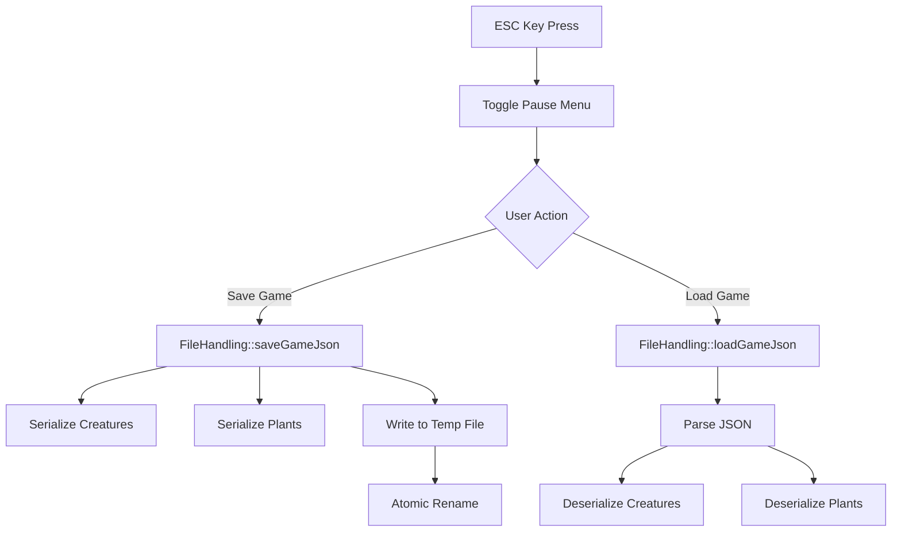

# Save/Load System

Technical documentation for EcoSim's JSON-based save/load system.

---

## Overview

The save/load system provides complete simulation state persistence using JSON format. It supports:

- Complete creature serialization including genetics
- Complete plant serialization including genetics
- Calendar and world state
- Atomic save operations to prevent corruption

---

## Architecture

### Components

| Component | File | Responsibility |
|-----------|------|----------------|
| [`FileHandling`](../../../src/fileHandling.cpp) | `src/fileHandling.cpp` | Save/load operations, file management |
| [`ImGuiOverlay`](../../../src/rendering/backends/sdl2/ImGuiOverlay.cpp) | Pause menu UI, save/load triggers |
| [`Creature::toJson()`](../../../include/objects/creature/creature.hpp) | Creature serialization |
| [`Plant::toJson()`](../../../include/genetics/organisms/Plant.hpp) | Plant serialization |

### Data Flow



---

## JSON Schema

### Top-Level Structure

```json
{
  "version": 1,
  "savedAt": "2025-12-28T12:00:00Z",
  "world": {
    "tick": 5000,
    "mapWidth": 500,
    "mapHeight": 500
  },
  "calendar": {
    "minute": 30,
    "hour": 14,
    "day": 5,
    "month": 3,
    "year": 1
  },
  "creatures": [ ... ],
  "plants": [ ... ]
}
```

### Creature Schema

```json
{
  "id": 42,
  "archetypeLabel": "Swift Grassland Hunter",
  "scientificName": "Velox pratensis",
  "position": {
    "tileX": 100,
    "tileY": 200,
    "worldX": 100.5,
    "worldY": 200.3
  },
  "lifecycle": {
    "age": 150,
    "lifespan": 500
  },
  "needs": {
    "hunger": 7.5,
    "thirst": 3.2,
    "fatigue": 2.1,
    "mate": 5.0
  },
  "health": {
    "current": 85.0,
    "max": 100.0,
    "woundSeverity": 0.0
  },
  "combat": {
    "targetId": -1,
    "inCombat": false,
    "isFleeing": false,
    "cooldown": 0
  },
  "genome": {
    "chromosomes": [ ... ]
  }
}
```

### Plant Schema

```json
{
  "id": 123,
  "speciesName": "berry_bush",
  "position": {
    "x": 50,
    "y": 75
  },
  "lifecycle": {
    "currentStage": "Adult",
    "currentAge": 200,
    "stageAge": 50,
    "isAlive": true
  },
  "resources": {
    "storedEnergy": 75.0,
    "currentBiomass": 25.0,
    "currentHeight": 1.5
  },
  "reproduction": {
    "hasSeeds": true,
    "seedCount": 5
  },
  "genome": {
    "chromosomes": [ ... ]
  }
}
```

### Genome Schema

```json
{
  "chromosomes": [
    {
      "type": "Morphology",
      "genes": [
        {
          "id": "HIDE_THICKNESS",
          "allele1": { "value": 0.65 },
          "allele2": { "value": 0.72 }
        }
      ]
    }
  ]
}
```

---

## API Reference

### FileHandling Class

#### `saveGameJson()`

Saves complete simulation state to a JSON file.

```cpp
bool saveGameJson(
    const std::string& filepath,
    const std::vector<Creature>& creatures,
    const World& world,
    const Calendar& calendar,
    unsigned currentTick,
    int mapWidth,
    int mapHeight
);
```

**Parameters:**
- `filepath`: Relative path within save directory (e.g., "quicksave.json")
- `creatures`: Vector of all creatures to save
- `world`: World object (for plant extraction)
- `calendar`: Current calendar state
- `currentTick`: Current simulation tick
- `mapWidth`, `mapHeight`: World dimensions

**Returns:** `true` if save succeeded, `false` otherwise.

**Implementation Details:**
1. Builds JSON object with all game state
2. Writes to `.tmp` file first
3. Atomically renames to final path
4. Removes temp file on failure

#### `loadGameJson()`

Loads complete simulation state from a JSON file.

```cpp
bool loadGameJson(
    const std::string& filepath,
    std::vector<Creature>& creatures,
    World& world,
    Calendar& calendar,
    unsigned& currentTick,
    int mapWidth,
    int mapHeight
);
```

**Parameters:**
- `filepath`: Relative path within save directory
- `creatures`: Output vector (cleared and populated)
- `world`: World object (plants added to tiles)
- `calendar`: Output calendar state
- `currentTick`: Output tick count
- `mapWidth`, `mapHeight`: Expected world dimensions (validation)

**Returns:** `true` if load succeeded, `false` otherwise.

**Implementation Details:**
1. Validates file exists and is valid JSON
2. Checks version compatibility
3. Validates world dimensions (warns if mismatch)
4. Deserializes creatures and plants
5. Adds plants to appropriate world tiles

#### `getFullSavePath()`

Returns the absolute path for a save file.

```cpp
std::string getFullSavePath(const std::string& filename) const;
```

#### `getSaveMetadata()`

Reads metadata from a save file without full deserialization.

```cpp
std::optional<SaveMetadata> getSaveMetadata(const std::string& filepath) const;
```

### Creature Serialization

#### `Creature::toJson()`

Serializes creature to JSON.

```cpp
nlohmann::json toJson() const;
```

#### `Creature::fromJson()`

Deserializes creature from JSON.

```cpp
static Creature fromJson(
    const nlohmann::json& json,
    int mapWidth,
    int mapHeight
);
```

### Plant Serialization

#### `Plant::toJson()`

Serializes plant to JSON.

```cpp
nlohmann::json toJson() const;
```

#### `Plant::fromJson()`

Deserializes plant from JSON.

```cpp
static Plant fromJson(
    const nlohmann::json& json,
    GeneRegistry& registry
);
```

---

## Pause Menu Integration

### ImGuiOverlay Methods

| Method | Purpose |
|--------|---------|
| `togglePauseMenu()` | Opens/closes the pause menu |
| `isPauseMenuOpen()` | Returns menu visibility state |
| `shouldSave()` | Returns true if user clicked Save |
| `shouldLoad()` | Returns true if user clicked Load |
| `shouldQuit()` | Returns true if user clicked Quit |
| `resetSaveFlag()` | Clears save request flag |
| `resetLoadFlag()` | Clears load request flag |

### Main Loop Integration

In [`main.cpp`](../../../src/main.cpp), the game loop checks for pause menu actions:

```cpp
// Handle save request from pause menu
if (renderer.shouldSave()) {
    std::string savePath = file.getFullSavePath("quicksave.json");
    bool success = file.saveGameJson(
        savePath, creatures, w, calendar,
        static_cast<unsigned>(tickCount), MAP_COLS, MAP_ROWS
    );
    renderer.resetSaveFlag();
}

// Handle load request from pause menu
if (renderer.shouldLoad()) {
    std::string savePath = file.getFullSavePath("quicksave.json");
    unsigned loadedTick = 0;
    bool success = file.loadGameJson(
        savePath, creatures, w, calendar,
        loadedTick, MAP_COLS, MAP_ROWS
    );
    if (success) tickCount = static_cast<int>(loadedTick);
    renderer.resetLoadFlag();
}
```

---

## File Locations

### Save Directory Structure

```
saves/
└── SAVE_02/
    ├── quicksave.json      # Main save file
    ├── quicksave.json.tmp  # Temporary during save
    ├── world.txt           # Legacy format (deprecated)
    ├── creatures.txt       # Legacy format (deprecated)
    ├── stats/
    │   └── general_stats.csv
    └── genomes/
        └── *.csv           # Genome exports for analysis
```

### Version Constants

```cpp
static const int SAVE_VERSION = 1;
```

---

## Error Handling

### Save Errors

| Error | Cause | Recovery |
|-------|-------|----------|
| Failed to create temp file | Disk full or permissions | Returns false, no state change |
| Write failure | Disk error during write | Removes temp file, returns false |
| Rename failure | Filesystem error | Removes temp file, returns false |

### Load Errors

| Error | Cause | Recovery |
|-------|-------|----------|
| File not found | Save doesn't exist | Returns false |
| Parse error | Invalid JSON | Returns false with error message |
| Version mismatch | Incompatible save version | Returns false with version info |
| Dimension mismatch | World size changed | Warning only, continues loading |

---

## Legacy Compatibility

The system maintains backward compatibility with legacy CSV saves:

- Legacy methods (`saveState()`, `loadState()`) are marked `[[deprecated]]`
- Legacy files (`world.txt`, `creatures.txt`) can still be loaded
- New saves always use JSON format

> **Note:** Legacy saves do not include plant genetics or complete creature state.

---

## Performance Considerations

### Save Performance

- Plants are collected from all world tiles - O(width × height)
- JSON serialization is single-threaded
- Pretty-printed output (2-space indent) for human readability
- Typical save time: <1s for 500 creatures, 1000 plants

### Load Performance

- Single file read operation
- Creature deserialization includes genome reconstruction
- Plants are added back to tiles by position
- Typical load time: <1s for 500 creatures, 1000 plants

---

## Future Improvements

Potential enhancements for the save/load system:

- [ ] Multiple save slots with selection UI
- [ ] Auto-save at configurable intervals
- [ ] Save compression for large worlds
- [ ] Async save to prevent frame drops
- [ ] Save file thumbnails/previews
- [ ] Cloud save support

---

## See Also

- [[../reference/api/core-classes]] - Core class API reference
- [[../../user/usage-guide]] - User guide with save/load instructions
- [`fileHandling.hpp`](../../../include/fileHandling.hpp) - Header file
